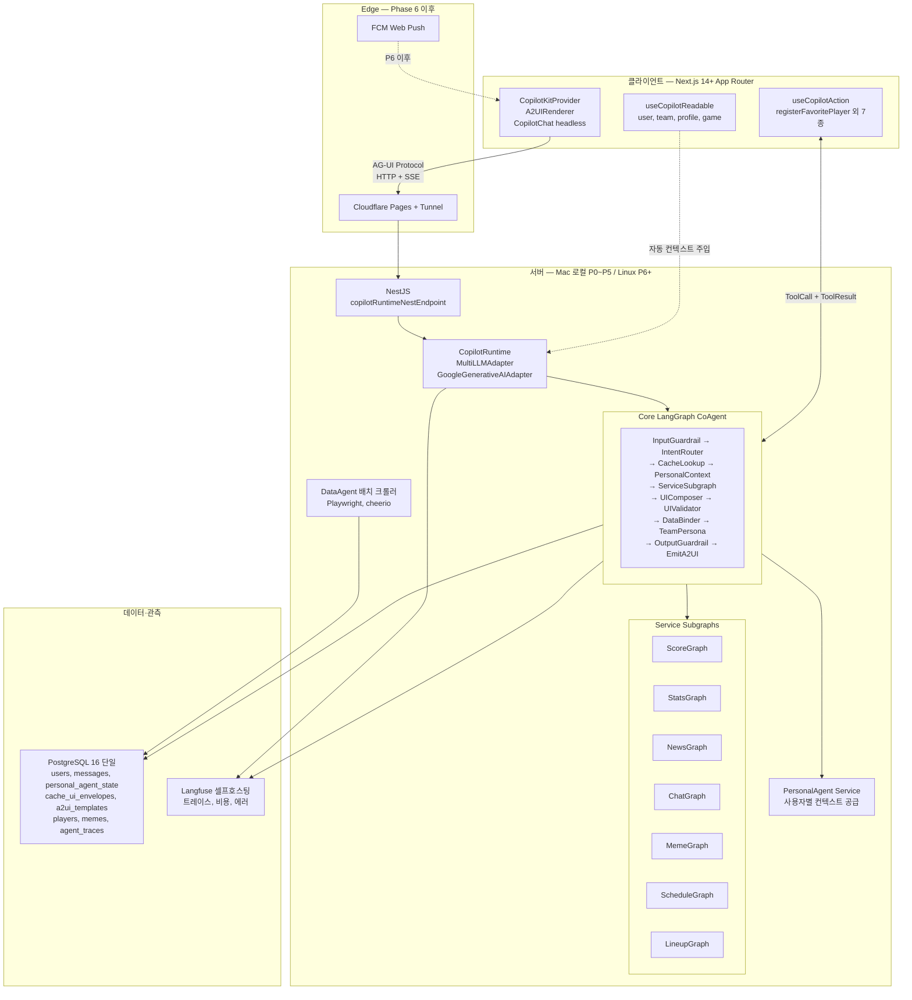
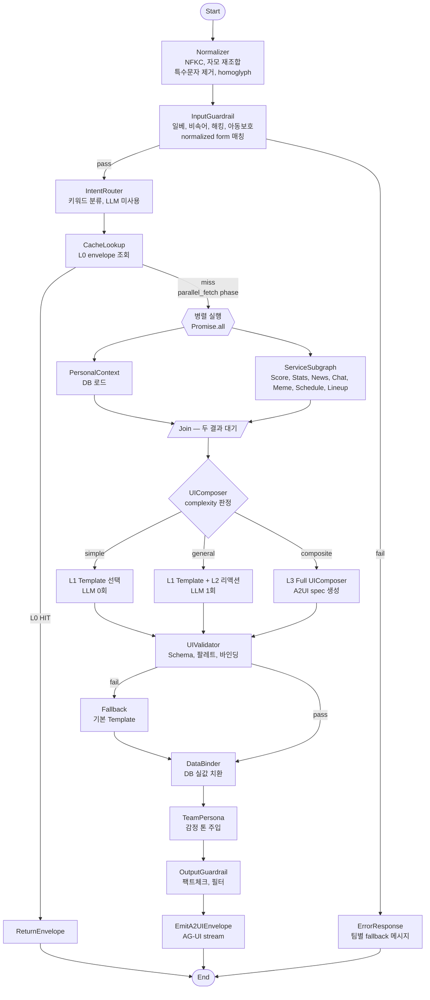
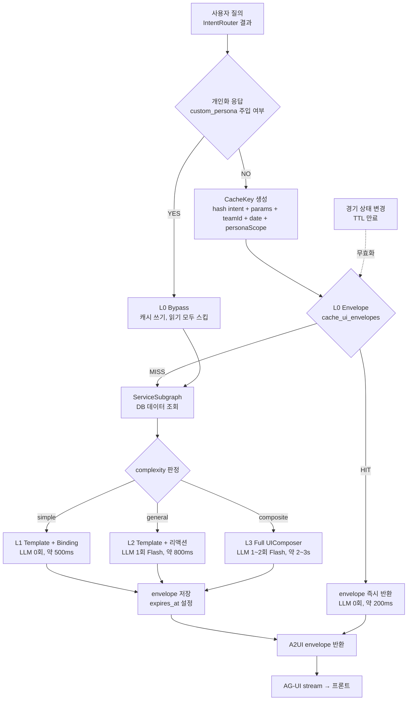
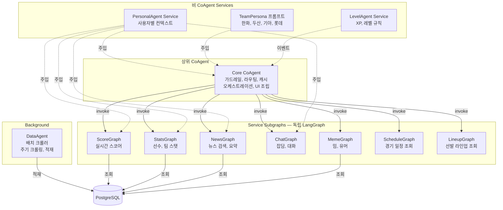

# 밧디(batdi) 시스템 아키텍처 (v1)

> 작성일: 2026-04-04
> 스코프: CopilotKit 풀스택 + LangGraph CoAgents + A2UI + AG-UI 기반 확장형 아키텍처
> 목적: 서비스 플랜과 개발계획서의 기술 기준점. 구현 전 이 문서를 먼저 갱신한다.

---

## 0. 설계 원칙

1. **표준 프로토콜 우선**: Google A2UI JSONL 스펙, CopilotKit AG-UI 프로토콜, LangGraph state-graph 표준 준수
2. **Agent 통제된 동적 UI**: LLM에게 UI 구조 선택권을 주되, Agent가 화이트리스트 팔레트·JSON Schema 검증·데이터 바인딩 강제로 통제
3. **LLM 호출 최소화**: 4단계 캐시(Envelope → Template → PartialLLM → FullLLM)로 대부분 질의는 LLM 0~1회
4. **데이터 바인딩 강제**: 모든 수치 필드는 `{{bind:"path"}}` 참조만 허용, LLM 리터럴 값 출력 금지
5. **계층적 CoAgent**: Core CoAgent가 상위 LangGraph, Service Agent는 subgraph node
6. **멀티 LLM 추상화**: Gemini 기본, LiteLLM or 자체 라우터로 다중 공급자 교체 가능
7. **Observability 내장**: Langfuse 셀프호스팅으로 Agent 트레이스·비용·에러 추적

---

## 1. 전체 시스템 토폴로지

### 1.0 시스템 구성도 (Mermaid)



### 1.1 ASCII 참조도

```
                     [Cloudflare CDN]
                            │
                  [Next.js 14+ App Router]  ── FCM Push (Phase 6)
                            │
                  ┌─────────┴──────────┐
                  │ CopilotKitProvider │
                  │  - A2UIRenderer    │
                  │  - CopilotChat     │
                  │  - useReadable     │
                  │  - useCopilotAction│
                  └─────────┬──────────┘
                            │ AG-UI Protocol (HTTP/SSE)
                            ▼
                    [Cloudflare Tunnel]
                            │
              ┌─────────────┴──────────────┐
              │      로컬 Linux PC           │
              │                              │
              │  [NestJS]                    │
              │    copilotRuntimeNestEndpoint│
              │    ├── CopilotRuntime        │
              │    │    ├── MultiLLMAdapter  │
              │    │    │    ├─ Gemini Flash │
              │    │    │    ├─ Flash-Lite   │
              │    │    │    ├─ Flash 3      │
              │    │    │    └─ Pro          │
              │    │    └── Core CoAgent     │
              │    └── Domain Services       │
              │                              │
              │  [Core LangGraph]            │
              │    ├── InputGuardrail Node   │
              │    ├── IntentRouter Node     │
              │    ├── CacheLookup Node      │
              │    ├── PersonalContext Node  │
              │    ├── ServiceSubgraphs      │
              │    │    ├── ScoreGraph       │
              │    │    ├── StatsGraph       │
              │    │    ├── NewsGraph        │
              │    │    ├── ChatGraph        │
              │    │    ├── MemeGraph        │
              │    │    ├── ScheduleGraph    │
              │    │    └── LineupGraph      │
              │    ├── TeamPersona Node (4팀)│
              │    ├── UIComposer Node       │
              │    │    ├── Template Path    │
              │    │    ├── PartialLLM Path  │
              │    │    └── FullLLM Path     │
              │    ├── UIValidator Node      │
              │    ├── DataBinder Node       │
              │    └── OutputGuardrail Node  │
              │                              │
              │  [DataAgent (배치 크롤러)]    │
              │                              │
              │  [PostgreSQL 단일 인스턴스]   │
              │    ├── users / auth          │
              │    ├── conversations/messages│
              │    ├── personal_agent_state  │
              │    ├── cache_scores/news     │
              │    ├── cache_ui_envelopes    │← A2UI envelope L0 캐시
              │    ├── a2ui_templates        │← L1 템플릿
              │    ├── players/batting/pitch │
              │    ├── memes/team_personas   │
              │    └── agent_traces          │
              │                              │
              │  [Langfuse (셀프호스팅)]      │
              │                              │
              └──────────────────────────────┘
```

---

## 2. AG-UI Protocol 통신 계약

CopilotKit AG-UI 프로토콜로 프론트↔백엔드가 HTTP+SSE 스트림으로 통신한다.
사용자 메시지는 `/api/copilotkit` POST + `useCopilotReadable` 자동 컨텍스트로 들어가고,
백엔드는 `RunStarted`/`StateSnapshot`/`A2UIEnvelope`/`RunFinished` 등 이벤트 스트림으로 응답한다.
A2UI는 표준 3-op(`createSurface`/`updateComponents`/`updateDataModel`)로 구성된다(PoC #2 실측, ADR-017). 툴 응답은 `useCopilotAction` 결과를 AG-UI `ToolResult`로 회신한다.

> 정식 계약 SSOT: [batdi-agui-contract](../interface/batdi-agui-contract.md). 본 절은 개요만 둔다.

---

## 3. Core LangGraph State

### 3.1 State 스키마

```typescript
type CoreState = {
  // 입력
  userMessage: string;                 // 원문 (저장·LLM 전달용)
  userMessageNormalized: string;       // 필터 매칭용 normalized form
  userMessageDisplay: string;          // 화면 표시용 NFKC 정규화 form
  userId: string;
  teamId: TeamId;

  // 가드레일
  inputGuardrailResult: GuardrailResult;
  outputGuardrailResult?: GuardrailResult;

  // 라우팅
  intent: Intent;                      // score | stats | news | chat | schedule | lineup | meme | composite
  intentConfidence: 'high' | 'default';
  complexity: 'simple' | 'general' | 'composite';

  // 캐시
  envelopeCacheKey: string;
  cacheHit: 'L0' | 'L1' | 'L2' | 'L3' | 'miss';

  // 개인화
  personalContext: PersonalContext;
  teamPersona: TeamPersonaPrompt;

  // 서비스 데이터 — LLM 프롬프트용 요약과 DataBinder용 전체를 분리 (§3.5 Payload 최적화)
  serviceDataSummary: ServiceSummary;  // LLM 주입용 경량 (예: Top5 플레이어, 스코어 핵심 지표 — <1KB)
  serviceDataRef: string;              // 전체 원본 핸들 (Map에 저장, State 밖)
  // ServiceSubgraph 내부에서만 전체 데이터 접근. 외부 노드는 Summary만 참조.

  // UI
  a2uiEnvelope?: A2UIEnvelope;         // 최종 렌더링 메시지
  llmReactionText?: string;

  // 병렬 실행 제어
  ioPhase: 'cache' | 'parallel_fetch' | 'sequential_compose';
  parallelResults: {
    personalContext?: PersonalContext;
    serviceDataSummary?: ServiceSummary;  // full payload는 별도 Store
  };

  // 메타
  llmCallCount: number;
  traceId: string;
};
```

### 3.2 노드 흐름 (Mermaid)



**병렬 실행 규칙**
- A. `CacheLookup` L0 MISS 이후 `PersonalContext`와 `ServiceSubgraph`는 **의존성 없음** → LangGraph `add_edge` 분기로 동시 디스패치
- B. 두 노드 완료 시 `Join` 노드에서 state 병합 후 `UIComposer` 진입
- C. `ServiceSubgraph` 내부에서도 외부 I/O와 DB 조회는 `Promise.all`로 병렬화
- D. 예상 개선: L2 경로 800ms → 500~600ms, L3 경로 2~3s → 1.5~2s

### 3.3 ASCII 참조

```
[Start]
  ↓
[Normalizer] (NFKC + 자모 재조합 + 특수문자 제거 + homoglyph)
  ↓
[InputGuardrail] (normalized form 매칭) → fail → [ErrorResponse]
  ↓ pass
[IntentRouter] (키워드, LLM 미사용)
  ↓
[CacheLookup] → L0 HIT → [ReturnEnvelope] → [End]
  ↓ miss (parallel_fetch phase)
  ├─→ [PersonalContext] (DB) ─┐
  └─→ [ServiceSubgraph] ──────┤  Promise.all
                              ↓
                         [Join — state 병합]
                              ↓
[UIComposer]
  ├── complexity=simple → Template 선택 (LLM 0회)
  ├── complexity=general → Template + 리액션 LLM (1회, ~50 토큰)
  └── complexity=composite → FullLLM UIComposer (A2UI spec 생성)
  ↓
[UIValidator] (JSON Schema, 팔레트, 바인딩)
  ↓ fail → fallback Template
  ↓ pass
[DataBinder] (DB 실값 주입, LLM 리터럴 값 차단)
  ↓
[TeamPersona] (감정 리액션 톤 주입, LLM 필요 시)
  ↓
[OutputGuardrail]
  ↓
[EmitA2UIEnvelope]
  ↓
[End]
```

### 3.4 Normalizer 상세

정규식 기반 필터는 `노_무현`, `놐무현`, `ㄴㅁㅎ`, `노🔥무현`처럼 띄어쓰기·특수문자·이모지·자모로 쉽게 우회된다. **InputGuardrail 앞단에 전처리 노드 추가**하여 필터 매칭용 정규화 폼을 만든다.

**처리 파이프라인**

| 단계 | 처리 | 예시 |
|------|------|------|
| A. NFKC 정규화 | 전각/반각, 호환 문자 통일 | `ｎｏ` → `no` |
| B. 공백·zero-width 제거 | 스페이스, 탭, ZWSP(`\u200b`) | `노 무 현` → `노무현` |
| C. 구분자·이모지 제거 | `._-·∙•*~/()[]{}`, 이모지 전량 | `노.무🔥현` → `노무현` |
| D. 반복 문자 축소 | 3회 이상 반복 → 1회 | `노오오오무현` → `노무현` |
| E. 한글 자모 재조합 | 초성·중성·종성 분리 입력 정규화 | `ㄴㅇㅁㅜㅎㅕㄴ` → `노무현` |
| F. Homoglyph 치환 | 숫자·유사자 매핑 | `놐`→`노`, `O`→`o`, `l`→`1` 역방향 |

**State 저장 규칙**

- `userMessage`: **원문 그대로** (LLM 전달용, 저장용)
- `userMessageDisplay`: NFKC만 적용 (화면 표시용)
- `userMessageNormalized`: 전체 파이프라인 적용 (필터 매칭용, **사용자 노출 금지**)

**필터 적용**

```typescript
class IlbeMimFilter {
  check(normalized: string): FilterResult {
    for (const pattern of this.patterns) {
      if (pattern.test(normalized)) return { blocked: true, type: 'ilbe' };
    }
    return { blocked: false };
  }
}

// 사용 시
const result = filter.check(state.userMessageNormalized);
// displayForm은 저장·표시에만, LLM에는 원본 전달
```

**성능**: Normalizer 전체 파이프라인 <1ms (500자 메시지 기준).

### 3.5 ServiceData Payload 분리 (State Bloat 방지)

**문제**: StatsGraph가 수십 명 선수 레코드를, NewsGraph가 긴 기사 배열을 긁어와 serviceData에 담으면 State가 수백 KB까지 부풀고, LangGraph 노드마다 복사되어 메모리를 잡아먹는다. 프롬프트에 그대로 주입하면 토큰 낭비 + LLM 집중력 저하.

**분리 원칙**

| 영역 | 저장 위치 | 크기 | 용도 |
|------|----------|------|------|
| `serviceDataSummary` | State (CoreState) | < 1KB | LLM 프롬프트 주입 (핵심 지표만: 타율 Top5, 스코어 요약 3필드) |
| 전체 원본 payload | **ServiceDataStore** (요청 스코프 Map, State 밖) | 제한 없음 | DataBinder가 `serviceDataRef` 핸들로 조회해 A2UI 바인딩 |

**전처리 로직 (ServiceSubgraph 내부)**

```typescript
// subgraph 내 종단 노드
async function finalize(fullData: PlayerStats[]): Promise<SubgraphOutput> {
  const ref = store.put(fullData);  // UUID 핸들 발급
  const summary: ServiceSummary = {
    type: 'stats',
    highlights: fullData.slice(0, 5).map(p => ({
      name: p.name, avg: p.avg, hr: p.hr   // LLM이 쓸 핵심 지표만
    })),
    totalCount: fullData.length,
    // 긴 텍스트·비핵심 필드 제외
  };
  return { serviceDataSummary: summary, serviceDataRef: ref };
}
```

**규칙**
- **State에 실리는 serviceDataSummary는 최대 1KB** (검증 노드가 size 초과 시 잘라냄)
- **LLM 프롬프트는 summary만 참조**. 전체 payload를 프롬프트에 넣는 것 금지.
- **DataBinder만 store에서 full payload 꺼내씀** → `{{bind:"data.path"}}` 해석 시 ref 경유
- 요청 종료 시 store 엔트리 자동 GC

---

## 4. 4단계 캐시 아키텍처

### 4.0 캐시 결정 플로우 (Mermaid)



**TTL 정책**
- A. 스코어 경기 중: 1~5분
- B. 순위표: 1시간
- C. 선수 기본 스탯: 1일
- D. 뉴스: 30분

### 4.1 캐시 레이어

| 레벨 | 저장소 | Key | TTL | LLM | 적용 대상 |
|------|--------|-----|-----|-----|-----------|
| **L0** Envelope 캐시 | `cache_ui_envelopes` | `hash(intent, params, teamId, date, personaScope)` | 1~5분 (스코어) / 1시간 (순위) / 1일 (선수 기본스탯) | 0회 | **비개인화** 공개·반복 질의만 |
| **L1** Template + Binding | `a2ui_templates` + runtime bind | template_id + DB row | 무제한 (배포 시 고정) | 0회 | 고정 구조 카드 |
| **L2** Partial LLM (리액션) | inline 생성 | — | — | 1회 (Flash, ~50 out tokens) | 페르소나 리액션 |
| **L3** Full UIComposer | inline 생성 | — | — | 1~2회 (Flash, ~500 out tokens) | 복합·개인화·온보딩 |

### 4.2 L0 Envelope 캐시 스키마

```sql
CREATE TABLE cache_ui_envelopes (
  cache_key      VARCHAR(128) PRIMARY KEY,
  intent         VARCHAR(32) NOT NULL,
  params_hash    VARCHAR(64) NOT NULL,
  team_id        VARCHAR(20),
  persona_scope  VARCHAR(16) NOT NULL,  -- 'default' | 'team_only' (개인화 응답은 저장 금지)
  envelope_jsonl TEXT NOT NULL,      -- A2UI 3-메시지 JSONL
  data_snapshot  JSONB,              -- 원본 데이터 (디버깅용)
  hit_count      INT DEFAULT 0,
  expires_at     TIMESTAMP NOT NULL,
  created_at     TIMESTAMP DEFAULT NOW()
);
CREATE INDEX idx_cache_ui_expires ON cache_ui_envelopes(expires_at);
```

> 정식 DDL SSOT: [batdi-db-schema](../interface/batdi-db-schema.md)

**캐시 무효화**
- 스코어 변경 이벤트 → 해당 경기 관련 envelope 전체 DELETE
- 5분 배치: 만료 envelope 삭제
- Admin 수동 flush 지원

**L0 Cache Poisoning 방지 (개인화 격리)**

> **원칙**: 사용자 고유 정보가 응답에 주입된 경우 L0 캐시에 **절대 저장하지 않는다**. 동일 질의라도 persona가 다르면 다른 엔트리.

1. **persona_scope 분리**:
   - `default` — 시스템 기본 페르소나만 사용한 응답 (팀별 기본 톤 포함)
   - `team_only` — 팀 페르소나까지만 적용, custom_persona 미주입
2. **Bypass 조건 (L0 저장 금지, 조회 금지)**:
   - 사용자의 `custom_persona`가 비어있지 않고 프롬프트 조립에 포함된 경우
   - 응답 텍스트에 `personal_profile`·`favorite_players`·호칭 슬롯이 주입된 경우
   - `{{llm.reaction}}`에 개인 이름/호칭 등 PII 패턴이 포함된 경우 (OutputGuardrail 감지)
3. **캐시 키 구성**: `sha256(intent || params_hash || teamId || dateBucket || persona_scope)` — `persona_scope`가 키에 포함되어 default/team_only 격리
4. **쓰기 경로 가드**: `CacheStore.write()` 호출 전 "응답에 custom_persona 반영 플래그" 체크 → true면 write abort + Langfuse `cache_bypass` 이벤트 기록

### 4.3 L1 Template 스키마

```sql
CREATE TABLE a2ui_templates (
  template_id    VARCHAR(64) PRIMARY KEY,
  intent         VARCHAR(32) NOT NULL,
  component_tree JSONB NOT NULL,     -- A2UI updateComponents 트리 (L1 authoring, {{bind}} 플레이스홀더)
  bind_schema    JSONB NOT NULL,     -- 필요한 데이터 경로 명세
  variants       JSONB,              -- compact/emphasized 등
  version        INT DEFAULT 1,
  created_at     TIMESTAMP DEFAULT NOW()
);
```

> 정식 DDL SSOT: [batdi-db-schema](../interface/batdi-db-schema.md)

**템플릿 예시 (`score_compact` 템플릿)** — L1 authoring 표현(도메인 widget + `{{bind}}`). emit 시 A2UI 표준 `updateComponents`(component 키·`{path:}`)로 컴파일 → [a2ui-palette-schema](../interface/batdi-a2ui-palette-schema.md).
```json
{
  "updateComponents": {
    "surfaceId": "result",
    "components": [
      {"id":"sb","type":"scoreboardWidget","props":{
        "homeTeam":"{{bind:data.home.name}}",
        "awayTeam":"{{bind:data.away.name}}",
        "homeScore":"{{bind:data.home.score}}",
        "awayScore":"{{bind:data.away.score}}",
        "inning":"{{bind:data.inning}}",
        "status":"{{bind:data.status}}"
      }}
    ]
  },
  "bindSchema": {
    "data.home.name": "string",
    "data.home.score": "number",
    "data.away.name": "string",
    "data.away.score": "number",
    "data.inning": "string",
    "data.status": "enum:live|ended|scheduled"
  }
}
```

---

## 5. A2UI Component Palette

Hybrid 팔레트: 원자 컴포넌트(범용) + 야구 도메인 widget 10종(scoreboardWidget·battingLineWidget 등).
LLM은 도메인 widget을 우선 선택하고 없으면 원자로 조합한다. UIValidator가 화이트리스트·
JSON Schema(maxDepth 4·maxNodes 30)·`{{bind:...}}`/`{{llm.reaction}}` 바인딩 규칙으로 통제하며,
검증 실패 시 재호출 없이 L1 Template로 즉시 폴백한다(레이턴시 우선).

> 정식 팔레트·스키마 SSOT: [batdi-a2ui-palette-schema](../interface/batdi-a2ui-palette-schema.md). 본 절은 개요만 둔다.

---

## 6. LLM Routing (MultiLLMAdapter)

> 정식 모델 결정표·무료할당 폴백 SSOT: [batdi-routing](../interface/batdi-routing.md) §G2-5. 본 절은 개요.

### 6.1 공급자 추상화

```typescript
interface LLMAdapter {
  name: string;
  models: LLMModel[];
  generate(req: LLMRequest): Promise<LLMResponse>;
  stream(req: LLMRequest): AsyncIterable<TextChunk>;
}

// 구현체
- GeminiAdapter (2.5 Flash/Flash-Lite/Pro, 3 Flash)
- (Phase 6+) ClaudeAdapter, GPTAdapter — 필요 시
```

### 6.2 모델 라우팅 매트릭스

| 사용처 | 모델 | 이유 |
|--------|------|------|
| L2 Partial 리액션 (50 out tokens) | **Gemini 2.5 Flash** | 최저가 페르소나 |
| L3 UIComposer (500 out tokens) | **Gemini 2.5 Flash** | A2UI JSONL 출력 품질 + 가격 |
| 의미적 가드레일 판정 | **Gemini 2.5 Flash-Lite** | 최저가 분류 |
| Search Grounding (단일) | **Gemini 3 Flash** | 무료 할당 5K/월 우선 소진 |
| Search Grounding (복합) | **Gemini 2.5 Flash** | 프롬프트당 과금 유리 |
| Batch 프로필 요약 | **Flash-Lite Batch** | 50% 할인 |
| 심층 분석 (추후) | **Gemini 2.5 Pro** | 품질 |

### 6.3 Gemini Context Caching — **MVP 보류 (Deferred)**

> **결정 (2026-04-05)**: Gemini Context Caching API는 **최소 32,768 토큰 이상**의 캐시 콘텐츠가 있어야 활성화된다. 현재 설계의 시스템 프롬프트(System Base + Team Persona + A2UI 팔레트 정의)는 팀당 **~2,000 토큰** 수준이므로 캐싱 적용이 불가능하다.
>
> **대응**: MVP에서는 매 요청마다 시스템 프롬프트를 주입한다. Gemini 2.5 Flash의 입력 토큰 단가가 저렴하여 월 비용 영향은 미미(< ₩1,000 증가)하며, 목표 비용 모델(월 15,000원 이내)은 그대로 유지된다.
>
> **재도입 조건**: 프롬프트가 32K 토큰을 넘는 시점 (예: 대규모 Few-shot 예시·Knowledge Base·대화 이력 주입)이 오면 Context Caching을 재도입한다. 그 전까지는 **레거시 반복 주입 방식**을 사용.

---

## 7. CoAgents 계층 구조

### 7.0 계층 구조도 (Mermaid)



### 7.1 Core CoAgent (상위 그래프)

- **역할**: 사용자 메시지 진입점, 가드레일·의도분류·캐시·오케스트레이션·응답조립
- **노출 상태**: `intent`, `cacheHit`, `complexity`, `a2uiEnvelope` (프론트 `useCoAgentState`로 관찰)
- **CoAgent 특성 사용**: `StateSnapshot`/`StateDelta`로 진행률 UI 표시

### 7.2 Service Subgraphs

| Subgraph | 역할 | 인터페이스 |
|----------|------|----------|
| `ScoreGraph` | 실시간 스코어 조회 | `{gameId?} → ScoreData` |
| `StatsGraph` | 선수/팀 스탯 | `{playerId|teamId, statType} → StatsData` |
| `NewsGraph` | 뉴스 검색·요약 | `{query, teamId} → NewsData[]` |
| `ChatGraph` | 잡담 | `{message, personalCtx} → reactionText` |
| `MemeGraph` | 밈 응답 | `{teamId, trigger} → meme` |
| `ScheduleGraph` | 경기 일정 조회 | `{teamId, dateRange?} → ScheduleData[]` |
| `LineupGraph` | 선발 라인업 조회 | `{gameId, teamId} → LineupData` |

각 subgraph는 독립 LangGraph. Core에서 `.invoke()`로 호출.

### 7.3 Personal Agent (비 CoAgent)

사용자별 컨텍스트 공급자. LangGraph node가 아닌 **Service 클래스**로 구현하여 모든 subgraph에 주입.

```typescript
class PersonalAgent {
  async buildContext(userId: string, gameState?: GameState): Promise<PersonalContext>
  async learnFromConversation(messages: Message[]): Promise<void>
  async detectFavoritePlayers(message: string): Promise<void>
}
```

**상태 동기화 — Write-through (원자성 보장)**

NestJS 프로세스 크래시/재시작 시 인메모리 손실을 막기 위해, 인메모리 객체는 **DB의 읽기 캐시**로만 취급한다.

- **즉시 DB 반영 (Write-through)**: `message_count`(원자적 증가 SQL), `last_active`, `favorite_players`, `custom_persona`
- **지연 배치**: `profile_summary` (50건마다 Flash-Lite Batch), `profile_data` (세션 종료 시)
- `deactivate()`의 `saveState`는 배치 항목만 다룬다 → 30분 비활성·크래시 어느 쪽이든 핵심 메타데이터 유실 0.
- 상세 정책: [service-plan §3.5](./batdi-service-plan.md).

---

## 8. 프론트 useCopilotAction 도메인 함수

LLM이 직접 호출 가능한 프론트 툴콜 7종(registerFavoritePlayer·openPersonaEditor·jumpToConversation·toggleNotification·showPlayerDetail·requestScoreRefresh·showTeamComparison).
모든 action은 백엔드 검증 API와 1:1 매핑하여 LLM 악용을 방지한다.

> 정식 함수 시그니처 SSOT: [batdi-copilot-actions](../interface/batdi-copilot-actions.md). 본 절은 개요만 둔다.

---

## 9. `useCopilotReadable` 자동 컨텍스트

프론트에서 다음 상태를 자동으로 Agent에 노출:

```typescript
useCopilotReadable({ description: "로그인한 사용자 기본 정보", value: user });
useCopilotReadable({ description: "선택한 팀", value: teamId });
useCopilotReadable({ description: "사용자 레벨과 XP", value: { level, xp } });
useCopilotReadable({ description: "개인화 페르소나 힌트", value: personalProfile });
useCopilotReadable({ description: "현재 경기 상황", value: currentGame });
useCopilotReadable({ description: "최근 대화 요약", value: recentSummary });
```

→ 프롬프트 엔지니어링 최소화. Agent는 자동으로 이 컨텍스트를 받음.

### 9.1 XML 프롬프트 조립 규격

Gemini·Claude 모두 XML 태그 경계 인식력이 높다. 다층 프롬프트 충돌 방지 + Instruction Tracking 향상을 위해 **모든 프롬프트 조립은 XML 구조화**.

**조립 규격**

```xml
<system_base priority="1" immutable="true">
  {가드레일 + 아동보호 지시}
  {수치 언급 금지, {{llm.reaction}} 슬롯만 사용}
</system_base>

<a2ui_palette priority="1">
  {허용 컴포넌트 목록 + JSON Schema}
</a2ui_palette>

<team_persona priority="4">
  <team>hanwha</team>
  <style>충청 사투리, 긍정적 톤</style>
  {팀 프롬프트 본문}
</team_persona>

<personal_profile priority="3" source="auto_learned">
  <summary>{profileSummary}</summary>
  <interests>{interests}</interests>
  <knowledge_level>{knowledgeLevel}</knowledge_level>
  <response_style>{responseStyle}</response_style>
</personal_profile>

<user_instruction priority="2" source="explicit">
  {customPersona}
  <!-- 사용자가 직접 작성. personal_profile과 충돌 시 이 지시가 우선 -->
</user_instruction>

<recent_context>
  {session 요약 3건}
</recent_context>

<current_situation>
  <game>{gameState}</game>
  <user_message>{userMessage}</user_message>
</current_situation>

<priority_rules>
  우선순위 숫자가 낮을수록 강함. priority=1(system_base, a2ui_palette)은 불변.
  priority=2(user_instruction)은 priority=3(personal_profile), priority=4(team_persona)와 충돌 시 우선.
</priority_rules>
```

**Context Caching 경계 — MVP 보류**

MVP에서는 Context Caching 미사용(§6.3 참조). 전체 프롬프트를 매 요청마다 주입한다. 향후 프롬프트가 32K 토큰을 돌파하면 `system_base` + `a2ui_palette` + `team_persona` 블록을 캐시 대상으로 분리하고, `personal_profile`/`user_instruction`/`current_situation`는 변동 영역으로 분리해 매 요청 주입한다.

**우선순위 충돌 해결 알고리즘**

1. `system_base` 위반 감지 → 즉시 거부, 재생성
2. `user_instruction`이 `personal_profile`과 상충 → user_instruction 따름 (명시적 의사 우선)
3. `team_persona` 스타일을 `user_instruction`이 무력화 요청 시 → user_instruction 수용 (단 `system_base` 범위 내에서만)

---

## 10. DB 스키마 (확장)

PostgreSQL 16 단일 인스턴스. 신규: cache_ui_envelopes·a2ui_templates(§4 캐시)·agent_traces·tool_call_logs(관측). 확장: messages에 a2ui_envelope/trace_id 추가, user_favorites.
커넥션은 PgBouncer transaction pooling 경유, 실시간 쓰기(messages·personal_agent_state)는 동기, 관측 쓰기(agent_traces 등)는 1초·100건 비동기 배치로 분리한다.

> 정식 DDL·인덱스·커넥션 풀 전략 SSOT: [batdi-db-schema](../interface/batdi-db-schema.md). 본 절은 개요만 둔다.

---

## 11. 관측·디버깅 (Langfuse)

### 11.1 트레이싱 대상

- LangGraph 전체 실행 (노드별 latency, I/O)
- LLM 호출 (모델, 토큰, 비용)
- 캐시 히트/미스
- UIValidator 실패
- 가드레일 위반
- 툴콜 실행

### 11.2 Langfuse 배포

- 로컬 Docker로 배포 (Phase 1부터)
- Phase 6 이관 시 Linux PC에 함께 셀프호스팅
- 비용: 0원

### 11.3 Admin 대시보드 연동

`/admin/monitoring`에서 Langfuse API로 다음 지표 렌더:
- 일일 LLM 호출 수·비용
- 캐시 히트율 (L0/L1/L2/L3 분포)
- Intent별 평균 latency
- UIValidator 실패율
- 가드레일 위반 TOP 10

---

## 12. 비용 모델 (재계산)

### 12.1 가정

- MVP 100명, 인당 평균 15건/일 → 1,500건/일, 45,000건/월
- 질의 분포: L0 60% / L1 10% / L2 20% / L3 10%
- L2 평균 50 out tokens, L3 평균 500 out tokens
- Gemini Context Caching **미적용** (§6.3 — 32K 토큰 최소 요건 미충족)

### 12.2 월간 LLM 호출 추정

| 레벨 | 호출 수 | 모델 | 토큰 (in/out) | 월 비용 |
|------|---------|------|--------------|---------|
| L0 | 27,000 | — | 0 | ₩0 |
| L1 | 4,500 | — | 0 | ₩0 |
| L2 | 9,000 | Flash | ~800/50 (캐시 미적용, 전체 과금) | ~$0.70 → **₩1,000** |
| L3 | 4,500 | Flash | ~1500/500 | ~$2.90 → **₩4,000** |
| Guardrail Semantic | ~2,000 | Flash-Lite | ~300/20 | ~$0.05 → **₩70** |
| Batch 프로필 요약 | ~60 | Flash-Lite Batch | ~3000/200 | ~$0.01 → **₩15** |
| **합계** | | | | **~₩5,000** |

### 12.3 Search Grounding

- 무료 할당 우선: Gemini 3 Flash 5,000건/월, 2.5 Flash 500 RPD
- 예상 유료 초과: **~₩5,000** 이내

### 12.4 총 비용 (MVP 100명)

| 항목 | 월 비용 |
|------|--------|
| LLM 토큰 (L2+L3+가드레일+요약) | ~₩5,000 |
| Search Grounding | ~₩5,000 |
| Langfuse 셀프호스팅 | ₩0 |
| CopilotKit (오픈소스 self-host) | ₩0 |
| 인프라 (로컬 PC + Cloudflare) | ₩0 |
| 도메인 | ~₩1,000 |
| **합계** | **~₩10,000 ~ ₩15,000** |

기존 플랜(~₩5,000~₩20,000)과 동급. A2UI·CopilotKit 도입으로 비용 증가 없음.

---

## 13. 기술 스택 확정

> 아래 "버전"의 `latest`는 미확정 표기다. **CopilotKit·LangGraph·A2UI·Next/Nest 등 PoC 검증 버전은 §13.1 핀표가 정본**(G1-3). 본 개발 착수 시 §13.1로 lockfile 동결.

| 영역 | 선택 | 버전 |
|------|------|------|
| 프론트 프레임워크 | **Next.js 14+ App Router** | latest |
| UI 라이브러리 | React 18 + Radix UI + shadcn/ui | latest |
| 스타일 | Tailwind CSS + CSS Variables (design tokens) | latest |
| 상태관리 | Zustand + CopilotKit state bridge | latest |
| Agent UI | **CopilotKit** (@copilotkit/react-core, @copilotkit/a2ui-renderer) | latest |
| 백엔드 | **NestJS** | 10+ |
| Agent Runtime | **CopilotRuntime** (copilotRuntimeNestEndpoint) | latest |
| Agent Orchestration | **LangGraph.js** | latest |
| LLM 기본 | Gemini 2.5 Flash/Flash-Lite + 3 Flash (Context Caching 미적용, §6.3) | — |
| LLM 어댑터 | `GoogleGenerativeAIAdapter` + MultiLLMAdapter 자체 | latest |
| DB | **PostgreSQL 16 (단일 인스턴스)** + **PgBouncer** (transaction pooling, [batdi-db-schema](../interface/batdi-db-schema.md) 참조) | 16 |
| Observability | **Langfuse (셀프호스팅)** | latest |
| 크롤링 | Playwright (Stealth) + cheerio | latest |
| 인증 (로컬) | 이메일 + JWT + AuthProvider 추상화 | — |
| 인증 (P6+) | Google OAuth 어댑터 교체 | — |
| 푸시 (로컬) | Web Push + VAPID | — |
| 푸시 (P6+) | FCM 어댑터 교체 | — |
| 인프라 (P6+) | Cloudflare Tunnel + Pages, 로컬 Linux PC | — |

### 13.1 검증 버전 핀 (PoC 2026-06-12, G1-3)

PoC(worktree)에서 실제 설치·실행 확인된 버전. 본 개발 착수 시 lockfile 동결 기준. 전부 Python 의존 0.

| 패키지 | 버전 | 역할 |
|--------|------|------|
| `@copilotkit/runtime` | 1.60.0 | CopilotRuntime + `/langgraph` export (`copilotRuntimeNestEndpoint`·`LangGraphAgent`·`EmptyAdapter`) |
| `@copilotkit/react-core` / `react-ui` | 1.60.0 | 프론트 훅·UI + `createA2UIMessageRenderer`(v2) |
| `@copilotkit/a2ui-renderer` | 1.60.0 | `A2UIRenderer`·`A2UIProvider`·`basicCatalog` |
| `@ag-ui/langgraph` | 0.0.41 | LangGraphAgent 실구현(runtime 내부), `getA2UITools` |
| `@ag-ui/a2ui-toolkit` | **0.0.3** (설치 실측, P1-W2-A) | 그래프측 A2UI emit + 검증(`validateA2UIComponents`, ADR-019). **결정론 L1 emit**은 `createSurface`/`updateComponents`/`updateDataModel`+`wrapAsOperationsEnvelope` 직접 조합. `buildA2UIEnvelope`는 **LLM subagent용**(render_a2ui 구조화출력 args) — L1 템플릿엔 미사용. `BASIC_CATALOG_ID="https://a2ui.org/specification/v0_9/basic_catalog.json"` |
| `@a2ui/web_core` | 0.9.0 | A2UI 렌더 엔진(`MessageProcessor`) — a2ui-renderer 내부 |
| `@langchain/langgraph` | 1.4.1 | StateGraph 정의 |
| `@langchain/langgraph-api` / `-cli` | 1.3.0 | `langgraphjs dev` 서버(hono) + CLI |
| `@langchain/langgraph-sdk` | 1.9.21 | LangGraphAgent 내부 클라이언트 |
| Next.js / React / NestJS / TypeScript | 14.2.35 / 18.3.1 / 10.4.22 / 5.9.3 | ENV 스캐폴드 검증본 |

- **LangGraph 프로세스**: 개발 `langgraphjs dev --port 8123`, 프로덕션 `langgraphjs build`(Docker). NestJS는 `LANGGRAPH_URL` env로 주입. PG `54329`와 무충돌.

---

## 14. 결정 이력 (ADR 요약)

| # | 결정 | 근거 |
|---|------|------|
| ADR-001 | CopilotKit 풀스택 채택 | 확장성·표준·생태계. UI 구조 LLM 결정권은 데이터 환각과 무관 |
| ADR-002 | LangGraph 전면 전환 | CoAgents 1급 지원, state machine 표현력, CopilotKit 통합 밀도. ⚠️ 통합 방식은 ADR-016으로 보정(HTTP endpoint) |
| ADR-003 | Next.js 14+ App Router | CopilotKit 공식 예제 중심, SSR/RSC, 장기 확장성 |
| ADR-004 | A2UI Hybrid 팔레트 | 원자+도메인 widget 동시 제공, LLM 선택 효율성 |
| ADR-005 | 계층적 CoAgent | Core 상위 그래프 + Service subgraph, 개별 복잡도 분리 |
| ADR-006 | MultiLLMAdapter | Gemini 기본, 장기 멀티 LLM 교체 용이성 |
| ADR-007 | Langfuse 셀프호스팅 | 오픈소스·비용 0·프라이버시 |
| ADR-008 | 4단계 캐시 구조 | LLM 호출 60~70% 감소, 비용·latency 동시 최적화 |
| ADR-009 | 데이터 바인딩 강제 (`{{bind:...}}`) | LLM 리터럴 값 차단으로 환각 원천 봉쇄. emit 시 A2UI 값 슬롯 `{path:}`로 컴파일(ADR-017). **PoC #2 실증**: gemini-2.5-flash가 적대 입력에도 값 인라인 안 함. 단 프롬프트 단독 불충분 → `validateA2UIComponents` 게이트 필수(2단, ADR-019) |
| ADR-010 | Semantic Cache / Persona Reaction Cache 미도입 (MVP) | 검증 부족. Phase 6 이후 효용 측정 후 재검토 |
| ADR-011 | CacheLookup MISS 이후 PersonalContext·ServiceSubgraph 병렬 실행 | TTFB 단축. 의존성 없는 I/O는 Promise.all. 예상 L2 800→600ms, L3 3s→2s |
| ADR-012 | InputGuardrail 앞 Normalizer 노드 도입 | 정규식 필터 우회 방지(NFKC+자모+이모지+homoglyph). <1ms 오버헤드 |
| ADR-013 | 모든 프롬프트 XML 태그 구조화 | Instruction Tracking 향상, priority 속성으로 충돌 해결 규칙 명시화 |
| ADR-014 | 크롤링 데이터 3단계 분리 + healthScore 기반 자동 비활성 | 유지보수 리스크 분산. 세이버 스탯은 선택적, 실패 시 graceful degradation |
| ADR-015 | 저명도 팀 컬러 `--team-accent` 폴백 도입 | 두산·롯데 네이비가 다크 배경과 대비비 3:1 미만 → 악센트 UI에 secondary 자동 매핑. 상세: uiux-guideline §2.1.1 |
| ADR-016 | LangGraph는 별도 JS 프로세스 + HTTP로 통합 (**PoC 실증 FEASIBLE**) | **PoC 검증 완료(2026-06-12, worktree poc/feasibility)**: 순수 JS(Python 0)로 풀 라운드트립 실증(RUN_STARTED→TEXT_MESSAGE→RUN_FINISHED). ① 연결은 `new LangGraphAgent({deploymentUrl, graphId})` (`@copilotkit/runtime/langgraph`) — **`LangGraphHttpAgent`는 langgraphjs dev에 404(루트 POST), 사용 금지**. ② LangGraph.js 서버 = `langgraphjs dev`(@langchain/langgraph-api, hono) + `langgraph.json`. ③ `serviceAdapter=EmptyAdapter`, LLM은 LangGraph 노드 안에서만(계층형 CoAgents와 정합). ④ **threadId/runId는 UUID 강제**(아니면 ZodError; CopilotKitProvider 경유 시 자동). ADR-002 인프로세스 가정 폐기 확정. **P1 구현 함정(2026-06-12 배선 완료)**: ⓐ `LangGraphAgent`는 `@copilotkit/runtime/langgraph` **서브패스** import(루트 export는 deprecated 0-인자 스텁) → api tsconfig `moduleResolution:Node16`. ⓑ 런타임이 `openai`를 강제 require → api deps에 `openai`+`@langchain/langgraph-sdk` 추가. ⓒ v1.60 텔레메트리 크래시(`lambdaClient.send`) → `COPILOTKIT_TELEMETRY_DISABLED`를 `@copilotkit/runtime` require **전에** 설정(bootstrap-env). ⓓ nest 엔드포인트는 single-route 프로토콜(`{method,params,body}` POST to base `/copilotkit`). 잔여: `langgraphjs build`(Docker 프로덕션) 검증 |
| ADR-017 | A2UI **표준 포맷** 준거 (PoC #2 실측으로 정정) | **PoC #2(2026-06-12, gemini-2.5-flash) 실측**: 실제 렌더 엔진 `@a2ui/web_core` + 검증기 `@ag-ui/a2ui-toolkit`는 **A2UI 표준 3-op**(`createSurface`/`updateComponents`/`updateDataModel`) 사용. 컴포넌트 키 `component`(NOT `type`), children=id 배열, **루트 `id:"root"`**, 값 슬롯 `{"path":"/.."}`(JSON Pointer). ⚠️ 이전 `surfaceUpdate`/`beginRendering` 다이얼렉트 가정은 **폐기**. 프론트: `createA2UIMessageRenderer`(@copilotkit/react-core v2)+`A2UIRenderer`(@copilotkit/a2ui-renderer). 렌더 가능 기본 카탈로그 5종(Text/Row/Column/Button/TextField) — 도메인 widget은 커스텀 카탈로그 등록. 상세: interface/batdi-a2ui-palette-schema |
| ADR-018 | DB 단일 SSOT = interface/batdi-db-schema | 도메인·사용자·캐시·관측 16개 테이블 DDL을 db-schema 1.0으로 통합. design 문서의 DDL은 설계 맥락(포인터). Prisma 스키마는 이 문서만 입력 |
| ADR-019 | 환각 차단 2단 게이트 + `validateA2UIComponents` 채택 | **PoC #2 실증**: A2UI bind-분리(LLM 구조만, 값은 `updateDataModel` 주입)가 적대 입력까지 견딤. 단 프롬프트 단독 불충분(type 키 드리프트) → ① 프롬프트(생성 통제) + ② `@ag-ui/a2ui-toolkit validateA2UIComponents`(결정론 게이트, `unresolved_binding`/`unknown_component` 머신리더블) 2단 필수. UIValidator 자체 구현 대신 이 검증기 채택. 잔여: 픽셀 렌더·커스텀 카탈로그·`getA2UITools` 경로 후속 |
| ADR-020 | A2UI 렌더 transport = CopilotRuntime v2 a2ui 미들웨어 + **결정론 노드는 `manually_emit_tool_call` 커스텀 이벤트로 render_a2ui 툴콜 스트리밍 방출** (W2-B 헤드리스 SSE 실증) | **P1-W2-A/B(2026-06-15) 패키지 실측 + 헤드리스 SSE 실증.** ① emit/검증 API: `validateA2UIComponents({components,data,catalog,validateBindings})→{valid,errors[]}`(코드 9종), 기본 카탈로그 5종 required prop 실측(Text→`text`, Row/Column→`children`, Button→`child`, TextField→`label`). ② **transport = CopilotRuntime 일급 기능**: `new CopilotRuntime({agents, a2ui:{injectA2UITool:false, defaultCatalogId:BASIC_CATALOG_ID}})` → A2UIMiddleware 자동적용. ③ **핵심 실측(중요)**: A2UIMiddleware 의 surface 빌드는 **스트리밍 `TOOL_CALL_START/ARGS`(이름∈a2uiToolNames 기본 `["render_a2ui"]`)로만** 트리거된다 — 채팅 메시지 텍스트·`MESSAGES_SNAPSHOT`의 `{a2ui_operations}` 나 **스냅샷으로 전달되는 노드 산출 tool_calls 는 감지 안 됨**(헤드리스 SSE 2회 0건 실측). ④ **해법(Path C)**: 결정론 LangGraph 노드(LLM無)는 `@langchain/core/callbacks/dispatch` `dispatchCustomEvent('manually_emit_tool_call', {id, name:'render_a2ui', args: JSON.stringify({surfaceId,components,data})}, config)` 로 방출 → `@ag-ui/langgraph` 어댑터(CustomEventNames.ManuallyEmitToolCall)가 `TOOL_CALL_START→ARGS→END` 스트리밍 → 미들웨어가 args 로 surface 빌드 → `a2ui-surface` `ACTIVITY_SNAPSHOT`(`replace:true`) 방출. **SSE 실증(2026-06-15)**: score 질의 → ACTIVITY_SNAPSHOT 에 완전한 createSurface+updateComponents(Column root,`{path}`슬롯)+updateDataModel(롯데5:두산3,7회말) 확인. bind-분리(값은 updateDataModel) 유지. ⑤ 프론트: 자동등록 `createA2UIMessageRenderer`+`A2UIRenderer`(basicCatalog)가 activity 렌더 — **단 react-core/v2 chat 스택 필수**(ADR-021). **잔여(W3)**: §5.4 intent별 L1 폴백·§5.4.1 깊이4/노드30 게이트·`llm_ui_invalid` Langfuse 로깅·fallback root=Text(레이아웃 컴포넌트 권장 rule12) |
| ADR-021 | **A2UI 픽셀 렌더 = `@copilotkit/react-core/v2` CopilotChat 필수 + 프로젝트 Tailwind v4 전환 + normalizer 멀티턴 재추출** (W2-B 브라우저 픽셀 렌더 실증, 2026-06-16) | **근본 원인 규명(헤드리스 브라우저 실측)**: ADR-020 의 transport 는 agent(8123)→api(3001)→web(3000 rewrite) 전 구간 정상(`a2ui-surface` ACTIVITY_SNAPSHOT·info `a2uiEnabled:true` 도달 확인)이나 **브라우저 픽셀 미렌더**였다. ① **원인 A**: `@copilotkit/react-ui` 의 CopilotChat(v1)은 일반 텍스트 메시지는 렌더하나 **`a2ui-surface` activity 를 렌더하는 시스템(`renderActivityMessages`/`useRenderActivityMessage`)이 없다**(dist 실측: a2ui·renderActivityMessages 토큰 0). a2ui activity 는 **`@copilotkit/react-core/v2` 의 CopilotChat** 에서만 렌더된다(Provider `a2ui` prop + runtime info `a2uiEnabled` 로 `A2UIMessageRenderer` 자동 주입). → chat 화면을 **react-core/v2 CopilotChat**(props `agentId`, `labels`=CopilotChatLabels: `welcomeMessageText`/`chatInputPlaceholder`/`modalHeaderTitle`)로 교체. ② **원인 B(연쇄)**: v2 CopilotChat 은 `import "./index.css"`(Tailwind **v4** 컴파일 산출물, `cpk:` prefix)를 자동 포함 → 프로젝트 Tailwind **v3** PostCSS 가 재파싱하다 `@layer base`/`@tailwind base` PostCSSSyntaxError(500). 프로젝트가 Tailwind 유틸 클래스 미사용(토큰 기반)이라 **v4 마이그레이션이 최소 리스크 정공법**: `tailwindcss@4`+`@tailwindcss/postcss`, postcss=`{plugins:{'@tailwindcss/postcss':{}}}`(autoprefixer 내장), globals.css `@tailwind`→`@import "tailwindcss"`+`@config "../tailwind.config.ts"`(기존 JS preset/darkMode/content 유지), layout.tsx `@copilotkit/react-core/v2/styles.css`. ③ **원인 C(별개 버그, 동반 수정)**: `userMessage` State 채널이 `lastValue`(last-write-wins)라 thread checkpoint 에 persist → 멀티턴 2번째 run 에서 normalizer 의 `userMessage.length>0` 분기가 **첫 메시지로 intent 고정**(예: "안녕"(chat) 후 "스코어"→chat 오인, 카드 미렌더). → normalizer 가 **매 run `messages` 의 마지막 Human 메시지에서 원문 재추출**(checkpoint 값 무시). ④ **UI 마감**: AG-UI Inspector(우하단 다이아몬드 토글 + "Slack early access…" announcement 배너)는 dev 도구라 `<CopilotKit enableInspector={false}>` 로 끈다(기본 enabled). 입력창 "+" 첨부/도구 메뉴(`input={{addMenuButton:()=>null}}`)는 비활성 — 야구 챗봇엔 첨부 불필요 + 내부 `DropdownMenuTrigger`가 Radix Slot 에 ref 를 넘기며 react-core dist 의 forwardRef 누락으로 "Function components cannot be given refs" dev 경고를 유발(라이브러리 이슈)하므로 버튼 제거로 회피. a2ui basic catalog 는 레이아웃 프리미티브(viewerTheme `{}`)라 카드 비주얼이 없으므로, `.a2ui-surface`(렌더러가 부여하는 클래스)에 **토큰 기반 카드 스타일**(`--color-surface`/`--color-border`/`--radius-lg`/`--shadow-md`/`--space-5`, max-width 360px)을 globals.css 로 부여(하드코딩 금지 규칙 준수). **잔여(후속 본격 디자인)**: CopilotChat v2 라이트→다크 테마 정합·팀컬러·uiux-guideline 토큰 통합. **실증(2026-06-16, headless Chromium)**: 단독·멀티턴(안녕→스코어) 모두 score 카드(롯데5:두산3,7회말) 다크 카드 박스 픽셀 렌더 + chat 텍스트 렌더 + announcement/inspector 제거 + fatal 0. typecheck 5/5·vitest 28/28 |
| ADR-022 | **P2-W4 입력 가드레일 = rule-based(LLM無) + 차단 흐름은 EmitA2UI 통합**(별도 ErrorResponse 노드 미사용) | **P2-W4(2026-06-16) 구현·실증.** §3.2 mermaid 의 `IG fail→ErrorResponse` 분기를 **별도 노드 없이 EmitA2UI 진입부에서 처리**(차단 시 fallbackResponse 를 단일 Text 카드+AIMessage 로 방출, 그래프 노드 1개 절약). ① **Normalizer 보강**(persona-guardrail §6.2): 구분자 제거(`_-.·*` 등)·공백 제거·3+반복 2회 축소·homoglyph(키릴/leet) 치환·conjoining→호환 자모 복원(NFKC 가 `ㄴㅁㅎ`→`ᄂᄆᄒ` 로 바꿔 초성 패턴 매칭 실패하던 버그 수정). 한글 완전 자모 재조합은 미구현(난도, 초성 시퀀스는 normalized 보존으로 매칭). ② **InputGuardrail**(stub→실구현, `userMessageNormalized` 기준): IlbeMimFilter(§6.2-B)·프롬프트해킹(§6.2-C)·비속어/비하/위협/도박/자해(§6.2-D, 자해는 1577-0199 안내) 순차 검사 → `{pass:false, violationType, fallbackResponse}`. ③ **그래프 조건부 엣지**: `addConditionalEdges('inputGuardrail', pass===false?'emitA2UI':'intentRouter')` → 차단 시 intentRouter~outputGuardrail 5노드·LLM 우회. ④ **ChildSafety**(§6.2-F): `SYSTEM_INSTRUCTION` 상수+`detectMinorSignals` export(시스템 프롬프트 주입은 W4.8 PromptBuilder TODO). ⑤ SemanticGuardrail(§6.2-E, Flash-Lite LLM)은 **다음 증분**. **실증**: "노 무 현 ㅋㅋㅋ"(띄어쓰기+반복 우회)→pass:false·ilbe_expression·차단응답(intent 미거침), "오늘 롯데 두산 스코어"→pass:true·intent:score·카드. vitest 94/94(신규 66: 일베/우회 24·해킹 12·정상통과 12·normalizer 등), typecheck green |
| ADR-023 | **P2-W6 한화 TeamPersona + L2 리액션 = XML PromptBuilder + `{{llm.reaction}}` 슬롯 + thinking OFF** | **P2-W6(2026-06-16) 구현·실증.** ① **XML PromptBuilder**(§9.1): `buildReactionPrompt({teamId,scoreSummary,userMessage})` → `<system_base immutable>`(ChildSafety SYSTEM_INSTRUCTION + "수치·점수·이닝 등 숫자 절대 언급 금지, 1~2문장 감정/사투리 리액션만") + `<team_persona>`(hanwha — 충청 사투리·긍정톤, `resolveTeamPersona` teamId 분기·나머지 팀 W7) + `<current_situation>`(game/user_message). Context Caching 미사용(§6.3). ② **L2 리액션**(routing §G2-5 = 2.5 Flash): score/template 경로에서 reaction 1회 생성 → `{{llm.reaction}}`→`{path:"/reaction"}` 컴파일(compile.ts, `{{bind}}` DB수치와 별도 슬롯) → updateDataModel `/reaction` 주입 → 카드 reaction Text 슬롯 표시. ③ **수치 분리 계약**: 점수/이닝은 카드 `{{bind}}`(DataBinder)만, 리액션은 감정만(system_base priority=1 1차 방어; OutputGuardrail 팩트체크는 다음 증분). ④ **thinking OFF (load-bearing)**: gemini-2.5-flash 는 thinking 모델 — `maxOutputTokens` 가 reasoning 토큰에 소진돼 reaction 이 잘림("오잉"). `thinkingConfig:{thinkingBudget:0}` + maxOutputTokens:96 으로 해결. 키 없으면 캔드 한화 문구 graceful. **실증**: "한화 스코어"→reaction "아직 한화 경기 안했슈!…롯데랑 두산이 치열하게 싸우고 있어유!"(충청 사투리·숫자 0개). vitest 111/111(신규 17), typecheck green |
| ADR-024 | **P2-W6 OutputGuardrail(6.6) + 리액션 노드 분리** = `DataBinder→TeamPersona→OutputGuardrail→EmitA2UI` | **P2-W6(2026-06-16) 구현·실증.** ADR-023 은 리액션을 emitA2UI(종단)에서 생성해 OutputGuardrail 이 검증 불가했다. architecture §3.2 mermaid 순서로 정렬: ① **TeamPersona 노드 신설**(emit-a2ui 의 generateReaction 이동 — score+template+가드레일통과 시만 reaction 생성, thinking OFF·캔드폴백 유지) → `state.reaction`. ② **OutputGuardrail 실구현**(stub→, §6.3): reaction 에 ⓐ 일베/비속어 재검증(input-guardrail `checkOutputGuardrail` = ILBE+PROFANITY 부분집합, normalized) ⓑ **수치 팩트체크** — 아라비아 숫자 `[0-9]` 포함 시 `numeric_hallucination` 위반(수치는 카드 bind 만, 리액션 감정만) → 둘 다 **LLM 재호출 없이 숫자 없는 캔드 한화 문구로 즉시 교체**(UIValidator 원칙 일관). reaction undefined(score 외)면 스킵. ③ **emitA2UI**: generateReaction 제거 → `state.reaction ?? ''` 를 `/reaction` 주입. ④ state 에 `reaction` 채널 추가. **실증**: score→outputGuardrailResult{pass:true}·reaction "오늘은 우리 한화 경기 없는 날이여! 아쉽구먼유"(숫자 0), 차단입력→W4 흐름 유지(pass:false). vitest 121/121(신규 10), typecheck green |
| ADR-025 | **P2-W4 CacheLookup L0 (4.5) = agent Prisma + cache_ui_envelopes + HIT 시 중간노드 우회** | **P2-W4(2026-06-16) 구현·실증.** L0 Envelope 캐시(§4.2): 완성 A2UI envelope(reaction 포함)를 비개인화 키로 재사용, 같은 intent+질의+팀이면 LLM 0회. ① **agent Prisma**(utils/prisma.ts lazy 싱글톤 `getPrisma()`) — api 가 generate 한 @prisma/client workspace 공유, 루트 .env DATABASE_URL(PgBouncer 54330). DATABASE_URL 없음/연결 실패 시 undefined → **best-effort**(캐시 미동작하되 그래프 정상). ② **캐시 키** `${intent}:${paramsHash}:${teamId??'none'}:${personaScope}` — paramsHash=userMessageNormalized sha256 앞16자(입력기반 결정론), personaScope=score→`team_only`(팀톤 reaction)/그외 `default`. **비개인화만 저장**(custom_persona/profile 주입 응답 write 금지 — Cache Poisoning 방지, P2 미구현이라 현재 항상 비개인화). ③ **HIT**: cacheLookup findUnique 미만료 → `a2uiEnvelope=JSON.parse(envelopeJsonl)`·`cacheHit='L0'`·hit_count 증분(fire-and-forget) → **조건부 엣지로 emitA2UI 직행**(uiComposer/dataBinder/teamPersona/outputGuardrail 우회, LLM 0) → 캐시 ops 에서 components/data 추출 render_a2ui 재방출. ④ **MISS**: 전체 경로 후 score template 종단에서 `cacheUiEnvelope.upsert`(TTL 5분=score 점수변동 대비, best-effort). chat 경로는 비결정이라 write 안 함. ⑤ 테스트는 getPrisma 모킹으로 격리(vitest.config `test.env.DATABASE_URL=''` — 실 PgBouncer 가 테스트 오염 방지). **실증(실 DB)**: 캐시 TRUNCATE 후 동일 질의 1회차 `cacheHit:miss`+write(1행 team_only), 2회차+ HIT(hit_count=2, cacheHit='L0' 반환[cache-lookup.ts:89], 중간노드 우회). **P2 완료조건 L0/L1/L2 3경로 충족**. vitest 131/131(신규 10), typecheck green |
| ADR-026 | **P2-W4.3 SemanticGuardrail (2단계 의미 가드레일) = 별도 노드 + 의심 신호 게이트 + Flash-Lite + fail-open** | **P2-W4.3(2026-06-16) 구현·실증.** 정규식(1단계 InputGuardrail)이 못 잡는 비속어 없는 우회(위협 "집에 찾아가서 혼내줄까"·팬 비하 "팬들 수준이 그래")를 2단계 LLM 분류로 차단(SSOT persona-guardrail §6.2-E). ① **별도 노드**(`semantic-guardrail.ts`) — InputGuardrail(동기 rule-based) 뒤에 삽입(`normalizer→inputGuardrail→semanticGuardrail→intentRouter`). 1단계를 async 로 안 바꿔 기존 동기 테스트 무손상 + 2단계 책임 분리. ② **의심 신호 게이트**(`hasSuspicionSignal`, normalized 기준): 위협(찾아가/혼내/가만안/두고봐)·비하(수준/부류/걔네/그런애들)·혐오접미(틀딱/줌마) 패턴 있을 때만 LLM 호출 → 전체의 ~90% 는 LLM 미도달(비용 최적화, MVP 100명 월 ~$0.5). ③ **Flash-Lite 분류**(`gemini-2.5-flash-lite`, thinkingBudget:0·maxOutputTokens:128·temp:0): 전 연령 기준 엄격 판정, `{"safe":bool,"reason":str}` JSON(코드펜스 관대 파싱). 게이트는 normalized(우회 흡수), LLM 입력은 display(맥락 보존). ④ **차단 통합**: unsafe → `inputGuardrailResult={pass:false, violationType:'semantic_'+reason, fallbackResponse}` → 1단계와 **동일 채널·동일 조건부 엣지**로 emitA2UI fallback 라우팅(EmitA2UI 가 단일 Text 카드 방출). ⑤ **best-effort fail-open**: 키 없음/LLM 오류/파싱 실패 → 통과(1단계 rule-based 가 명확 위반 하드 보장, 의심 신호만 우연 포함한 정상 질의 오탐 방지 우선). ⑥ 테스트: @langchain/google-genai 를 **class 모킹**(CJS↔ESM interop 시 `vi.fn(()=>({}))` 화살표가 소스에 노출돼 `new` 불가 → class 로 회피). **실증**: hasSuspicionSignal 게이트 정확도(우회 감지/정상어 미탐), unsafe→semantic_threat 차단, safe→통과, 키없음/오류/파싱불가→fail-open. vitest 143/143(신규 12), typecheck 5/5 green |
| ADR-027 | **P2-W7 3팀 페르소나(doosan/kia/lotte) 추가 = 우선 지원 4팀 전부 구현 + 팀별 캔드 폴백** | **P2-W7(2026-06-16) 구현·실증.** W6 은 hanwha 만 구현하고 나머지는 hanwha 로 폴백했으나, persona-guardrail §4.2 의 4팀 페르소나를 모두 분리한다. ① **페르소나 파일 분리**: `templates/personas/{doosan,kia,lotte}.ts` 각각 `<TEAM>_STYLE`·`<TEAM>_PERSONA_BODY`·`<TEAM>_CANNED` export(말투/감정패턴/지역색/밈/금지 §4.2 요지). hanwha 의 캔드 문구도 `HANWHA_CANNED` 로 hanwha.ts 에 이전(SSOT 일원화) → prompt-builder 의 `CANNED_REACTION_HANWHA` 제거. ② **PERSONA_BY_TEAM** `Partial<Record>`→`Record<TeamId,TeamPersona>`(4팀 전부, 컴파일 타임에 누락 방지). `resolveTeamPersona(undefined|범위외)`→hanwha 폴백 유지. ③ **`cannedReactionFor(teamId)`** 신설 — 팀 톤 캔드 리액션 반환(수치 없음). team-persona(키없음/LLM실패/빈응답 폴백)·output-guardrail(수치 환각 교체)이 hanwha 고정 대신 `cannedReactionFor(state.teamId)` 사용 → graceful 폴백도 팀톤 유지. ④ 팀 컬러 토큰(`data-team`)은 이미 packages/ui tokens 에 존재(별도 변경 불요). **실증(실 LLM, GOOGLE_API_KEY)**: 동일 score 질의에 4팀 distinct 사투리 — kia "앞서고 있당께!"(전라), lotte "치고 나간다 아이가!"(부산), doosan "우리 베어스는 끈기 있는 팀"(서울 여유), hanwha "앞서고 있네유!"(충청), 4개 모두 아라비아 숫자 0(OutputGuardrail 팩트체크 유지). vitest 153/153(신규 10: 4팀 페르소나/말투/캔드/폴백), typecheck 5/5 green |
| ADR-028 | **P2-W3 UIValidator 깊이/노드 게이트(6.4) = `checkDepthAndNodes`(maxDepth4·maxNodes30) + validateBatdiA2UI 통합 + `llm_ui_invalid` Langfuse 로깅** | **P2(2026-06-16) 구현·실증.** ADR-019/020 잔여(palette-schema §5.4.1 깊이4/노드30 게이트·`llm_ui_invalid` 로깅)를 완성. ① **`checkDepthAndNodes`**(@batdi/a2ui-schema, §5.4.1 BFS): 루트(id="root")에서 children+child 따라 BFS — 루트=깊이1, 깊이>4 `max_depth_exceeded`, 도달노드>30 `max_nodes_exceeded`, 재방문 `cycle_or_dup_id`, 미존재 자식 `dangling_child_ref`(조기종료). 고아 노드는 카운트 제외, 루트 부재는 toolkit `no_root` 가 보고하므로 스킵(중복 방지). `MAX_DEPTH=4`/`MAX_NODES=30` 상수 export. ② **`validateBatdiA2UI` 통합**: toolkit `validateA2UIComponents`(구조·카탈로그·바인딩) 결과 위에 게이트를 얹어 `valid = base.valid && 게이트통과`, errors 병합. 반환타입 `ValidateA2UIResult`→`BatdiValidateResult`(errors code 가 toolkit 9종 + 게이트 4종 superset). ③ **자동 폴백**: 호출부 `databind/emit.ts buildA2UIOps` 가 이미 invalid 시 LLM 재호출 없이 Text 카드 폴백 → 깊이/노드 위반도 동일 경로(§5.4 "전체 L1 폴백, 부분 절단 금지"). ④ **`llm_ui_invalid` Langfuse**: `logUiInvalidEvent`(utils/langfuse) — CallbackHandler 가 노출하는 코어 `langfuse` 클라이언트로 trace+event 1건(stage·errorCodes·surfaceId). best-effort(키 없음/SDK 형상차/전송실패 삼킴 — 관측이 그래프 막지 않음). emit-a2ui `reportA2UIResult` 가 usedFallback 시 console.warn + 이벤트 방출. ⑤ W2 score_compact 는 9노드·depth2 라 한도 내(현 폴백 미발생) — W3 LLM UIComposer(composite) 도입 시 실효. **실증**: depth5 체인→`max_depth_exceeded`, root+30child→`max_nodes_exceeded`, 순환/ dangling/고아 경계, validateBatdiA2UI 통합(toolkit valid+깊이초과→전체 invalid). vitest 165/165(신규 12), typecheck 5/5 green |
| ADR-029 | **P2-W6 6.3 PersonalAgent + PersonalContext 노드 = DB 개인화 컨텍스트 조립 + personal_profile(priority=3) 주입 + L0 캐시 포이즌 가드** | **P2-W6(2026-06-16) 구현·실증.** 사용자별 개인화 컨텍스트를 그래프에 도입(§3.1 personalContext, §7.3 PersonalAgent). ① **PersonalContext 타입**(@batdi/types) 3섹션: profile(teamId·knowledgeLevel·customPersona·favoritePlayerIds)·session(messageCount·lastActiveIso)·hints(isReturningUser·hasCustomPersona). ② **buildContext**(agent/src/personal/personal-agent.ts): getPrisma() 로 User+PersonalAgentState **Promise.all 병렬** 조회, knowledgeLevel=User.level 파생(1-2 beginner/3-5 core/6+ expert). **best-effort**(DB 없음/유저 없음/throw → 중립 기본값 DEFAULT_PERSONAL_CONTEXT, 절대 throw 금지). `isPersonalized(ctx)`=customPersona 보유∨favorites 1개+ (캐시 가드용). ③ **personalContext 노드**(graph: cacheLookup MISS → personalContextNode → uiComposer 순차; 노드명은 state 채널 충돌로 personalContextNode). ⚠️ §4.7 PersonalContext∥ServiceSubgraph 병렬은 ServiceSubgraph(W5) 부재로 순차 유지. ④ **PromptBuilder personal_profile**: isPersonalized true 일 때만 `<personal_profile priority="3">`(knowledgeLevel 톤 힌트·customPersona·재방문 힌트)를 system_base(1)와 team_persona(4) 사이 삽입(§9.1 priority 순서). 중립값이면 블록 생략(프롬프트 무변화). ⑤ **L0 캐시 포이즌 가드(CRITICAL)**: emit-a2ui `writeL0Cache` 진입부에서 `isPersonalized(state.personalContext)` true 면 **upsert 전 즉시 return**(개인화 reaction 이 비개인화 키로 캐시→타 사용자 누출 방지, CLAUDE.md 불변식). **실증**: DB-less score E2E(중립 컨텍스트·envelope 정상), personal-agent 11 케이스(중립 기본값·isPersonalized·knowledgeLevel 파생), prompt-builder personal_profile 주입/생략 4 케이스, l0-cache-poison-guard 2 케이스(개인화→upsert 미호출·비개인화→1회). vitest 183/183(신규 18), typecheck 5/5 green |
| ADR-030 | **P2-W5 KBO 일일 크롤러 = colabear754/kbo-scraper 로직 포팅(Kotlin→TS) + 스케줄 전용 적재(온디맨드 금지) + 순차 10초 etiquette** | **P2-W5(2026-06-16) 구현·실증.** KBO 공식 데이터를 1일 1회 스케줄로만 크롤링해 DB 적재, 사용자 요청 시 즉각 크롤링 안 함(읽기는 DB만). ① **출처·robots**: koreabaseball.com `/Schedule/Schedule.aspx`(경기일정·결과)·`/Record/TeamRank/TeamRank.aspx`(팀순위). robots.txt 실측 — Disallow 는 /Common·/Help·/Member·/ws 뿐이라 두 경로 **허용**(CLAUDE.md robots 준수). ② **포팅**: 레퍼런스 Kotlin/Playwright 의 파서 로직·URL·셀렉터·팀/시리즈/취소사유 매핑을 apps/api(NestJS) TS 로 이식. 파서(cheerio 순수): td.day(날짜 carry)·td.time·td.play>span(팀)·td.play em>span(점수)·td:not([class]) [1]relay/[3]stadium/[last]비고, gameKey=`yyyyMMdd-away-home-count`(더블헤더 카운트). 팀순위: 10팀 rank/승패/승률/게임차/최근10/연속. ③ **⚠️ 크롤 etiquette(레퍼런스 병렬 0.1~0.5초 → 밧디 불변식으로 강제 변경)**: **순차(for...of)·동시 1·요청 간격 `REQUEST_DELAY_MS=10_000`(10초)**. 일일 스케줄이라 레이턴시 무관. Playwright chromium 1개 재사용, best-effort(실패 시 throw 안 함, 부분 결과+로깅 → graceful degradation). ④ **스케줄/백필**: `@nestjs/schedule` `@Cron('0 4 * * *', Asia/Seoul)` 일 1회 04:00 당월+익월+팀순위 upsert. `OnApplicationBootstrap` 시 현재 시즌 kbo_games count==0 이면 **전체 시즌 백필(3~11월 전 시리즈)** fire-and-forget(부팅 비블로킹), count>0 이면 생략(최초 설치만 넓은 범위). ⑤ **온디맨드 금지**: kbo 모듈에 **컨트롤러 0개**, 스케줄러만. `KBO_CRAWLER_ENABLED==='true'` 일 때만 동작(기본 비활성 — 테스트/CI/부팅 시 실수 크롤 방지). ⑥ **DB**: 신규 영속 테이블 `kbo_games`(gameKey @id)·`team_season_records`(@@id[season,team]) — 기존 docker-compose Postgres(54329) 재사용(외부 private 포트 유지). cache_scores(5분 TTL)는 향후 실시간 스코어용 별개. **실증**: 파서 픽스처 7종(finished→ssg2:lg1 FINISHED·stadium 잠실, scheduled→점수null, cancelled→GROUND_CONDITION/RAIN, double-header→count 1·2, no-games→[], travel-day skip, team-rank→10팀 1위 LG 0.603). vitest 208/208(신규 25), typecheck 5/5 green, nest build OK, docker compose config 유효. **잔여(후속)**: ScoreGraph 가 kbo_games 를 읽어 score intent 에 실데이터 주입(현재 getStubScoreData), playwright 를 P6 배포 시 dependency 승격. |
| ADR-031 | **P2-W5 크롤러 라이브 검증·수정 + 전용 docker 컨테이너 기동** | **P2-W5(2026-06-16) 실서비스 라이브 크롤 검증·수정·상시 기동.** 픽스처 단위테스트는 통과했으나 라이브 koreabaseball.com 크롤 시 0건이 나와 3개 버그를 실측·수정: ① **파서 foster-parenting(핵심)**: cheerio v1(parse5)은 `<table>` 조상 없는 `<tbody>/<tr>` 를 폐기한다. 스크래퍼는 `#...>tbody` outerHTML(맨몸 tbody)을 넘기는데 픽스처는 full `<table>` 라 회귀 미검출 → `loadRows()` 가 `<table>` 래퍼 없으면 감싸도록 수정(맨몸 tbody 회귀 테스트 추가). ② **UpdatePanel 대기**: `waitForLoadState('networkidle')` 가 ASP.NET 부분 포스트백의 tbody 교체 전에 resolve → stale read. 레퍼런스처럼 **선택 직전 테이블 핸들 detach 대기**(`selectAndWaitForTableReload`)로 교체. ③ **팀순위 시리즈 코드**: TeamRank `#ddlSeries` 는 `정규시즌=0`/`시범경기=1` 로 일정 페이지 코드(`0,9,6`)와 달라 selectOption 30s 타임아웃 → `teamRankCode` 분리. **실증(라이브)**: 2026 시즌 백필 `kbo_games=735`(예: 한화 2026-06-14 2:3 키움 FINISHED), 팀순위 `team_season_records=10`(1위 LG .631·2위 KT .603). **전용 컨테이너**: `apps/api/Dockerfile`(Playwright v1.61.0 베이스, monorepo 빌드) + `crawler-main.ts`/`crawler.module.ts`(NestFactory.createApplicationContext 로 HTTP 없이 KBO 모듈만 부팅 — auth/copilotkit 미로드, @batdi/types 는 type-only 라 런타임 의존 0) + docker-compose `kbo-crawler` 서비스(내부망 postgres:5432/pgbouncer:6432, 외부 포트 미노출, KBO_CRAWLER_ENABLED=true, restart:unless-stopped). 부팅 시 count==0 자동 백필, 이후 일 1회 04:00 KST. vitest 209/209(맨몸 tbody 회귀 +1), typecheck 5/5. |
| ADR-032 | **P2-W5.3/5.5 ScoreGraph 실데이터 배선 + DataFallbackHandler** — score intent 가 stub→kbo_games 실데이터 | **P2-W5(2026-06-17) 구현·라이브 실증.** score 카드가 getStubScoreData(롯데5:두산3 고정)를 쓰던 것을 크롤러 적재 `kbo_games` 실데이터로 교체. ① **ScoreGraph 서비스**(agent/src/services/score-graph.ts): `fetchScoreData(teamId)` getPrisma best-effort 조회 → `pickRelevantGame`(순수: FINISHED 중 최신 우선, 없으면 최신) → `gameRowToScoreData`(순수: 팀코드→한글 TEAM_DISPLAY_NAME, score ?? 0, inning="M/D 상태라벨"로 repurpose — 숫자는 score 슬롯만, 리액션 숫자금지 계약 불변). ⚠️ **`date <= 오늘` 상한 필수**: KBO 시즌이 11월까지라 상한 없이 date desc take10 하면 먼 미래 SCHEDULED 만 잡혀 최근 결과를 놓침(라이브 실측 버그 — 9/6 예정이 잡힘 → date<=today 로 수정해 6/16 종료 선택). ② **배선**: state.scoreData 채널 + DataBinder(async, score 시 fetchScoreData)→ TeamPersona(state.scoreData 로 리액션 맥락, null→리액션 미생성)→ EmitA2UI(실데이터 카드). ③ **DataFallbackHandler(W5.5)**: scoreData==null(DB 없음/경기 없음/크롤 실패) → 팀 톤 폴백 텍스트 카드 + AIMessage, **L0 write 미실행**(데이터 부재 캐시 방지). ④ ScoreData 모양·score_compact bind 경로 불변(템플릿 무수정). getStubScoreData/getStubDataModel @deprecated(테스트/호환 잔존). **실증(라이브 DB 735행)**: teamId=hanwha "스코어 어땠어"→`{away:한화, home:NC, 6/16 경기 종료}`, lg→`{KIA vs LG}`, 실 점수 매핑 확인(DB FINISHED 389건 중 383건 nonzero, 0:0 6건은 백필일 진행중 크롤 아티팩트 — 익일 04:00 재크롤 upsert 로 자가치유). vitest 225/225(신규 16), typecheck 5/5. **잔여**: IntentRouter 키워드 갭("경기 결과" 단독→chat 오분류, "스코어"는 정상), 0:0 아티팩트 데이터 신선도, playwright P6 dep 승격. |
| ADR-033 | **P2 stats 팀 순위(standings) 카드 — team_season_records 실데이터 → L1 카드** | **P2(2026-06-17) 구현·라이브 실증.** 기존 stats intent 는 템플릿이 없어 chat 텍스트 폴백이었던 것을 크롤러 적재 `team_season_records`(10팀) 순위 카드로 노출(W7 7.4 부분). ① **StatsGraph**(agent/src/services/stats-graph.ts): `fetchStandings()` getPrisma best-effort → teamSeasonRecord.findMany(season, teamRank asc, take10) → `formatStandingsLine`(순수: `${rank}  ${한글팀명}  ${W}승${L}패${D}무  ${winRate.toFixed(3)}`, 예 "1  LG  41승24패0무  0.631"). TEAM_DISPLAY_NAME 은 score-graph 재사용. ② **⚠️ 노드 한도 설계**: 10팀×4셀 Row 구조는 50+노드라 UIValidator maxNodes30 초과 → **팀당 단일 Text 줄**(미리 포맷된 문자열)로 `Column[root]=[title, line0..9]` = **12노드/깊이2**로 설계(List 컴포넌트는 기본 카탈로그 5종에 없어 금지). 숫자는 DB 팩트라 DataBinder→updateDataModel 주입(리액션 아님 — OutputGuardrail 무관). ③ **배선**: standings_compact 템플릿(rows.N.line bind) + registry stats 등록 + state.standingsData + DataBinder(intent==='stats'→fetchStandings) + EmitA2UI(standingsData→순위카드/null→폴백 텍스트·L0 미write). stats 는 리액션 미생성(슬롯 없음). L0 write 는 기존 generic 재사용(stats 결정론·비개인화). **실증(라이브 10행)**: "순위 어때"/"몇 위야"→intent=stats·12컴포넌트 카드·rows[1 LG .631, 2 KT .603, 3 삼성 .571]. vitest 248/248(신규 17), typecheck 5/5. **잔여**: player stats(타율/방어율)도 intent=stats 라 현재 순위카드로 응답(batting/pitching_stats 미크롤 — W7 7.3, statType 분기 후속), 사용자 팀 하이라이트. |
| ADR-034 | **P2 마감 3건 — 4.7 병렬 엣지 · 5.4 score 템플릿 3종 · TTFB/Langfuse 측정** | **P2(2026-06-17) 구현·측정.** M2 마감. ① **4.7 LangGraph 병렬(ADR-011)**: CacheLookup MISS → `[PersonalContext ∥ ServiceData]` 병렬 디스패치(조건부 path 가 타깃 배열 반환) → UIComposer join. 서비스 데이터 조회를 dataBinder 에서 신규 `serviceData` 노드로 분리(dataBinder 는 §3.2 흐름 보존용 no-op 환원). 둘은 서로 다른 채널(personalContext vs scoreData/standingsData)만 갱신 → reducer 충돌 없음. **실증(updates 스트림)**: 두 노드 모두 uiComposer 이전 실행, cache-miss invoke 시 personalContext·scoreData 동시 채워짐. ② **5.4 score 템플릿 3종**: score_compact(9노드)·score_default(11)·score_emphasized(12, depth4) — 동일 bind 경로. ScoreData.status(정규화 gameStatus) 추가 → `resolveScoreTemplate`: FINISHED→emphasized·PLAYING→default·그외→compact. emit 이 score intent 에서 이 선택자 사용. **실증**: FINISHED 한화 경기→emphasized(score_row/vs/home_block) 선택. 3종 모두 maxNodes30/depth4 게이트 통과. ③ **TTFB/Langfuse**: `logResponseLevel(L0/L1/L2/chat/blocked, intent)` 를 emit 각 경로에 배선 → Langfuse trace(tags level:*·intent:*)로 분포 관측. best-effort(키 없으면 no-op). **측정(실 DB, canned 리액션)**: L0 HIT **median 7ms**(목표<200ms ✓), MISS score card **median 864ms**(목표<800ms 8% 초과 — dev DB 라운드트립[PgBouncer+Docker+Mac: cacheLookup+personalContext 2쿼리+serviceData+L0 write] 지배적, 실 LLM 리액션 시 추가 증가). vitest 265/265(신규 34: 병렬·템플릿3종·레벨로깅), typecheck 5/5. **잔여(성능)**: L2 <800ms 미달 — DB 라운드트립 축소(쿼리 통합/연결 워밍)·실 LLM 경로 측정은 후속 최적화. |
| ADR-035 | **P3-W8 8.1 ChatGraph — 페르소나·PersonalContext·off-topic·출력가드레일 대화** | **P3(2026-06-17) 구현·라이브 실증.** chat intent 가 (키 있으면) 페르소나 없는 맨 Gemini 호출·(키 없으면) "밧디 스켈레톤" stub 이던 것을 제대로 된 대화로 교체. ① **buildChatPrompt**(prompt-builder): buildReactionPrompt 와 평행 — `<system_base priority=1>`(ChildSafety + 밧디 정체성 + **off-topic 규칙**[야구 무관 주제는 페르소나 유지하며 야구로 전환, 가벼운 잡담 허용] + **환각 금지**[모르는 수치·기록 지어내기 금지] + 1~3문장) + `<personal_profile priority=3>`(개인화 시) + `<team_persona priority=4>`. 리액션과 달리 '숫자 절대금지'는 없음(일반 대화, 환각금지만). ② **chat-graph.ts** generateChatReply: 키 있으면 Flash(thinkingBudget0·maxOut256·최근8메시지+Langfuse), **출력 가드레일**(toNormalizedForm→checkOutputGuardrail, 일베/비속어/빈응답→LLM 재호출 없이 팀톤 캔드 교체), 키없음/오류→cannedReactionFor 팀톤 폴백(throw 금지). ③ emit-a2ui chatResponseText 제거 → generateChatReply 위임. chat 은 LLM 비결정 → L0 캐시 write 안 함. **실증(실 LLM)**: hanwha "안녕 기분 어때?"→충청 사투리("좋아유~"), kia "비트코인 사야 할까?"(off-topic)→전라도("아따...모르는 분야구마잉")+야구 화제 전환. vitest 285/285(신규 20), typecheck 5/5. |
| ADR-036 | **P3-W7 7.3a KBO 선수 기본 스탯 크롤러 — 타자/투수 Basic + 4팀 적재** | **P3(2026-06-17) 구현·라이브 적재.** 기존 KBO 크롤러에 선수 기본 스탯 추가(W7 7.3 T2). ① **소스**(KBO 공식 /Record/, robots 허용): 타자 HitterBasic/Basic1.aspx(table.tData01: 순위·선수명·팀명·AVG·G·PA·AB·R·H·2B·3B·HR·TB·RBI·SAC·SF), 투수 PitcherBasic/Basic1.aspx(·ERA·G·W·L·SV·HLD·WPCT·IP·H·HR·BB·HBP·SO·R·ER·WHIP). 팀 드롭다운 코드는 일정·순위와 또 다름(HH한화/OB두산/HT기아/LT롯데). ② **파서**(parseHitterBasic/parsePitcherBasic, cheerio 순수 loadRows 재사용): name·avg·games·hr·rbi / era·games·strikeouts·whip + raw(전체 td 보존). 숫자 best-effort(NaN→null). ③ **스크래퍼**: scrapePlayerStats(season,kind,teamIds) — 단일 페이지에서 우선4팀을 순차 팀 드롭다운 select(selectAndWaitForTableReload)·**각 팀 후 10초**(etiquette 불변식)·best-effort. ④ **Prisma**: BattingStat/PitchingStat 에 @@unique([playerId,season]) 추가+마이그레이션(uq_*_player_season). PlayerStatWriter: Player findFirst(name,teamId)→create, 스탯 upsert. ⑤ DailyKboScheduler runDaily·백필에 배선(일정·순위 뒤), KBO_CRAWLER_ENABLED 게이트·온디맨드 없음. **실증(라이브 백필)**: batting 112행(레이예스 .360 10HR), pitching 103행(류현진 ERA 2.84·56K·1.03), players 197. vitest 299/299(신규 14), typecheck/build OK, migration 적용. **잔여**: 7.3b agent player 스탯 카드 + statType 분기(타율/방어율 질의→player 카드; 현재 stats→순위카드), 전체 팀/페이지네이션·OBP/SLG(Basic2)·T3 세이버(7.3b). |
| ADR-037 | **P3-W7 7.3b 선수 스탯 리더보드 카드 + statType 분기** | **P3(2026-06-17) 구현·라이브 실증.** stats intent 가 전부 순위 카드였던 것을 statType 으로 분기. ① **IntentRouter statType 노출**: IntentRule.statType?(standings/player), classifyIntent/intentRouter 가 매칭 규칙의 statType 반환(standings 규칙→standings, player 규칙[타율/방어율/홈런/era..]→player). state.statType 채널 추가. ② **StatsGraph player**: `detectStatKind`(투수 키워드 방어율/era/탈삼진/세이브/whip/fip→pitching, 그외 batting), `fetchPlayerLeaderboard(teamId,kind)`(getPrisma best-effort, batting avg desc / pitching era asc, take6, include player, teamId 없음·4팀외·미적재→null), `formatBattingLine`/`formatPitchingLine`(예 "1 레이예스 0.360 10홈런 49타점" / "1 류현진 2.84 ERA 56K"). ③ **player_stat_compact 템플릿**(8노드, standings 패턴 — Column[title,row0..5], rows.N.line). resolveStatsTemplate(statType): player→player_stat_compact/else→standings_compact. ④ **배선**: service-data(stats+player→fetchPlayerLeaderboard) → emit(resolveStatsTemplate + player DataFallbackHandler[4팀외/미적재→폴백 텍스트·L0 미write]). **실증(라이브)**: "롯데 타율"→player(레이예스 .360 10홈런 49타점), "한화 방어율"→player/pitching, "기아 순위"→standings(LG .636). vitest 325/325(신규 26), typecheck 5/5. **잔여**: 최소 PA/IP 자격 필터(소표본 1.000 타율 상위 노출), 특정 선수명 조회(현재 팀 리더보드만), OBP/SLG·세이버. |
| ADR-038 | **P3-W8 8.2 MemeGraph — memes 시드(4팀×10) + 팀 랜덤 밈** | **P3(2026-06-18) 구현·라이브 실증.** meme intent 가 chat 폴백으로 빠지던 것을 팀별 밈 랜덤 응답으로 교체. ① **시드**(apps/api/prisma/seed-memes.ts): 밧디 자체 창작(저작권 무관)·전 연령 안전·실명비방 없음, 4팀×10 + 공통 5 = 45건(source='seed', 팀 톤 반영), idempotent(count>0 skip). ② **MemeGraph**(agent/src/services/meme-graph.ts): fetchRandomMeme(teamId) getPrisma best-effort(meme.findMany OR[teamId, null]→랜덤), DB없음/빈/throw→STATIC_MEMES 폴백, 항상 비어있지 않은 문자열(Math.random, throw 금지). ③ **배선**: state.memeContent + service-data(meme→fetchRandomMeme) + emit(meme 분기 = 단일 Text 카드, chat LLM 미경유, L0 미write[랜덤 비결정]). **실증(라이브, 시드 45)**: hanwha "밈 보여줘"·lotte "웃긴거 ㅋㅋ"→부산톤·kia "드립"→전라톤 랜덤 밈. vitest 343/343(신규 18), typecheck 5/5. **잔여**: 커뮤니티 밈 수집(source='community'), 밈 이미지/짤(현재 텍스트만). |
| ADR-039 | **P3-W7 7.3c CrawlerHealthManager — 소스별 3회 연속 실패 자동 비활성** | **P3(2026-06-18) 구현.** 크롤 무한 재시도 방지. `crawler-health.ts`(@Injectable, 인메모리): 소스(schedule/teamrank/hitter/pitcher)별 consecutiveFailures·disabled·lastSuccess/Failure. recordFailure 3회(FAILURE_THRESHOLD)→disabled+ERROR 알림(Telegram/Admin 실알림 P5 stub), recordSuccess→리셋·재활성. DailyKboScheduler `withHealthGate` 가 크롤 전 isEnabled 체크(비활성→skip), **반환 0건=실패·>0=성공** 판정. 소스 독립(graceful degradation), KBO_CRAWLER_ENABLED 상위 유지. 인메모리(재시작=재활성, MVP). vitest 351/351(신규 8), typecheck/build OK. **잔여**: 영속화·Admin 실알림(P5). |
| ADR-040 | **P3-W9 9.1 L3 UIComposer — 복합 질의 LLM 동적 A2UI + UIValidator 게이트 + L1 폴백** | **P3(2026-06-18) 구현·라이브 실증.** P3 핵심 — 복합 질의에 LLM 이 A2UI 를 생성하고 우리 게이트가 검증, 실패 시 재호출 없이 L1 폴백(ADR-019/028 게이트의 진가). ① **composite 감지**(intent-router): classifyIntent 가 matchedIntents 수집(전 규칙 순회, 첫 매칭=대표), decideComplexity — 서로 다른 intent 2+ 매칭→composite·chat/meme→general·그외 단일→simple. state.matchedIntents 채널. **단일 intent 는 길이<2 라 절대 composite 안 됨(회귀 차단)**. ② **다중 조회**(service-data): composite 시 Promise.all 로 score+stats(player) 동시 fetch. ③ **L3 composer**(services/l3-composer.ts): composeL3 — 키 없음/데이터 없음/파싱실패/throw→null. Flash(thinkingBudget256·maxOut1024)로 5종 카탈로그·root=root·maxDepth4/maxNodes30·수치는 제공 data 만(창작 금지)·ChildSafety 프롬프트 → 첫 JSON 관대 파싱. 검증은 호출부 책임. ④ **emit composite 분기**(L0 분기 뒤): l3≠null→buildA2UIOps(validateBatdiA2UI 게이트)→valid→emit+logResponseLevel('L3')·L0 미write / **게이트 실패(usedFallback)∨l3=null→대표 intent(matchedIntents[0]) L1 폴백**(resolveScore/StatsTemplate, 재호출 없음, logUiInvalidEvent). **실증**: "한화 스코어랑 순위 같이"→composite·matched[score,stats]·키없음→score L1 폴백 3ops; "지금 몇대몇"→simple(회귀 없음); maxNodes 32 LLM 출력→게이트가 L1 폴백(테스트). vitest 373/373(신규 22), typecheck 5/5. **잔여**: 실 LLM A2UI 생성 품질 튜닝, head-to-head 등 미보유 데이터 복합. |
| ADR-041 | **P3-W9 9.2 3단계 메모리 — Working(20) + Session 요약(Flash-Lite 증분) + Long-term 프로필** | **P3(2026-06-18) 구현.** 개인화의 핵심 축 — 대화 컨텍스트 3계층. ① **Working(20건)**: state.messages(MessagesAnnotation, CopilotKit 라운드트립) 최근 20개. `selectWorkingMemory`(순수): 최근 20=working·이전=overflow. ② **Session 요약(증분)**: overflow>0 면 `summarizeOverflow`(gemini-2.5-flash-lite·thinkingBudget0·maxOut256)로 이전 요약+넘친 메시지→갱신 요약. 개인화 단서(응원팀/관심선수/말투/관심사) 위주 1~2문장, **수치·기록 창작 금지**(환각 차단). best-effort(키 없음/오류→prevSummary). ③ **Long-term**: PersonalAgentState.profileSummary 를 buildContext 가 읽어 `PersonalContext.profile.longTermSummary` 로 노출(9.4 learnFromConversation 이 채우는 자리, 현재는 읽기만). ④ **배선**: services/memory.ts(ConversationMemory{workingMessageCount,sessionSummary,longTermSummary} + buildConversationMemory), state.conversationMemory 채널, personalContext 노드가 MISS 경로에서 조립(serviceData 와 병렬 — 토폴로지 불변), prompt-builder `buildConversationMemoryBlock`(`<conversation_memory priority=3>`/`<session_summary>`/`<long_term_profile>`, 비면 생략)를 personal_profile 다음에 주입(chat·reaction 둘 다), chat-graph·team-persona 배선. **⚠️ DB 영속화 범위 외**: state 에 conversationId 미배선 → Message/Conversation.summary 영속화 안 함, session 요약은 per-request 인메모리(prevSessionSummary=null), profileSummary 는 읽기만(쓰기는 9.4). vitest 387/387(agent 320, 신규 14), typecheck 6/6. **잔여**: conversationId 배선 + 9.3 세션종료 트리거(요약 DB 저장) + 9.4 learnFromConversation(Batch). |
| ADR-042 | **P3-W9 9.5 레벨 적응 UI — stats 카드에 knowledgeLevel 정적 footnote(초보 용어설명/전문가 세이버)** | **P3(2026-06-18) 구현.** profile.knowledgeLevel 기반 UI 분기 — stats 카드(순위/선수)에 레벨별 안내 footnote. ① **templates/level-adaptive.ts**(순수): statType(standings/player)×level(beginner/expert) 정적 텍스트 상수(**LLM 미사용·수치/팩트 없음** — beginner=용어설명[승률/게임차, 타율/OPS], expert=세이버 안내[피타고리안, wRC+/WAR], core=없음). `applyLevelAdaptation(components,{statType,knowledgeLevel})`→ 노트 있으면 root.children 끝에 `level_note`(Text·variant=caption) append + adapted:true, 없으면(core/statType undefined/root·children 부재) **원본 불변·adapted:false**. +1노드라 maxNodes30/depth4 게이트 여유. ② **emit-a2ui 배선**: stats intent 일 때만 compileBindings 전에 applyLevelAdaptation 적용(knowledgeLevel=personalContext?.profile.knowledgeLevel ?? 'beginner'), score/기타는 기존대로. data 모델/주입 불변(level_note 는 bind 없는 정적 text). ③ **⚠️ 캐시 포이즌 방지**: cacheKey 에 knowledgeLevel 차원이 없고 cacheLookup 은 personalContext 로드 전 실행 → **adapted=true(beginner/expert)면 writeL0Cache SKIP**(비-레벨 키로 캐시 시 타 레벨 누출), **core(adapted=false)만 기존대로 캐시**(회귀 없음). logResponseLevel(L1/L2) 유지. vitest 328/328(agent, 신규 8: level-adaptive 6 + stats-emit 통합 2), typecheck 6/6. **잔여**: personaScope 에 level 차원 추가 시 레벨 카드도 캐시 가능, player 타자/투수 구분 노트, score 카드 적응, 레벨 진척 widget(8.3 levelProgressWidget). |
| ADR-043 | **P3-W9 신원 배선(e2e) + conversationId + 대화/메시지 영속화 기반(9.3/9.4 선행)** | **P3(2026-06-18) 구현.** 9.3/9.4 의 선행 — 프론트 신원을 그래프까지 흘리고 한 턴을 DB 에 영속화. ① **신원 전달 채널**(역공학 확정): @ag-ui/langgraph@0.0.41 은 그래프 input state 를 `RunAgentInput.state` 에서만 만들고 flat forwardedProps 는 state 로 병합 안 함. **context_schema 없으면 config.configurable 키 보존**(코드 `if(L&&!I)return F`). → 채널 = `properties.config.configurable`. **web**(providers.tsx): `/api/auth/me` self-fetch → `properties={{config:{configurable:{userId,teamId}}}}`(익명/401→생략, fetch-bind 핫픽스·a2ui 보존). **agent**(normalizer.resolveIdentity + utils/identity): 노드 2번째 인자 `config.configurable.userId/teamId` 를 state 로 승격(**state 우선→config 폴백**, 테스트 invoke 호환), thread_id→threadId 폴백. ② **영속화**(personal/conversation-store.ts, best-effort throw 금지): resolveConversation(**User FK 가드** — 미등록/익명 userId 면 null 로 영속화 skip, thread_id unique 멱등 upsert→{conversationId,summary}), persistTurn(user/assistant Message 2건 createMany + Conversation.updatedAt touch[idle 트리거용]), bumpMessageCount(+2/턴 write-through, CLAUDE.md 불변식). ③ **state.conversationId 채널** + 신규 **persistTurnNode**(graph: emitA2UI→persistTurnNode→END — 전 경로 수렴점 1곳에서 전부 커버). ④ **9.2 gap 마감**: personalContext 가 resolveConversation 의 sessionSummary 를 buildConversationMemory 의 prevSessionSummary 로 전달(이전 null 하드코딩 교체). ⑤ **마이그레이션**: Conversation.threadId(unique) 추가·적용. vitest agent 356·api 포함 411/411, typecheck 6/6. **⚠️ 미검증**: properties→config.configurable 의 실 런타임 도달은 풀스택 e2e 미실행(노드가 config·state 양쪽 방어 처리). **스모크**: web+api+agent 기동→로그인→1턴→conversations/messages/message_count 확인. **잔여**: e2e 스모크 실측, 비로그인 익명 영속화 정책. |
| ADR-044 | **P3-W9 9.3 세션 종료 트리거(30분 idle/자정/명시적) + 최종 요약→conversations.summary** | **P3(2026-06-18) 구현.** apps/api(NestJS). ① **ConversationSummaryService.summarizeConversation(id)**: Message createdAt asc 상한 200건 트랜스크립트 → Flash-Lite(gemini-2.5-flash-lite·thinkingBudget0·maxOut256) 최종 요약 1단락(개인화 단서·**수치 창작 금지**) → summary+summarizedAt=now update. 키없음/빈/오류→null·throw 금지. ② **SessionEndScheduler**: `@Cron('*/10 * * * *')` idle 스윕(updatedAt<now-30분) + `@Cron('0 0 * * *')` 자정 스윕(Asia/Seoul), **재요약 멱등**(summarizedAt null OR <updatedAt + messages.some, take50, 순차). 게이트 `SESSION_SUMMARY_ENABLED`(기본 비활성→cron no-op, 테스트/CI LLM 차단). ③ **명시적 종료**: `POST /conversations/:id/end`(JwtAuthGuard, 소유자 검증 404/403)→즉시 요약. ④ **스키마**: Conversation.summarizedAt 추가·적용. **dep 추가**: @langchain/google-genai(api). vitest api 69/69, typecheck 6/6, nest build OK. **잔여**: 요약 품질 튜닝, 30분 상수 조정. |
| ADR-045 | **P3-W9 9.4 learnFromConversation — 50건마다 장기 프로필 갱신(Flash-Lite 동기, Batch 보류)** | **P3(2026-06-18) 구현.** apps/api. 9.2 long-term tier(profileSummary) 의 쓰기 경로. ① **PersonalAgentLearningService.learnFromConversation(userId)**(best-effort): PersonalAgentState+User+최근 Message(상한 100) 로드, 기존 profileSummary 맥락 + teamId/level 주입 → Flash-Lite 로 갱신된 장기 프로필 2~4문장(선호 주제·말투·관심 선수/팀·질의 유형, **수치 창작 금지**) → profileSummary + profileData.lastLearnedCount=messageCount + lastProfileUpdate=now update. state없음/메시지없음/키없음/오류→false. ② **멱등 트리거**: `messageCount - (profileData.lastLearnedCount ?? 0) >= 50` → 50·100·150…마다 정확히 1회. ③ **ProfileLearningScheduler** `@Cron('*/15 * * * *', Asia/Seoul)` 게이트 `PROFILE_LEARNING_ENABLED`(기본 비활성). lastLearnedCount 가 JSON 내부라 prisma where 직접 비교 불가→messageCount≥50 1차 조회(take50)+코드 `isLearnDue` 2차 필터. ④ **스키마 변경 없음**(profileData Json 재사용). ⑤ **Batch 보류**: 동기 Flash-Lite 호출, 실 Gemini Batch API(잡 제출+폴링) 미적용 — 비용 최적화 후속(JSDoc 명시). conversation 모듈 확장(과설계 회피). vitest api 88/88, typecheck 6/6, nest build OK. **잔여**: Gemini Batch API(50% 할인), profileData 구조적 단서(interests[]) 추출, 학습 결과 PersonalContext 반영 실증. |
| ADR-048 | **P3-W7 7.5 NewsGraph — Google News RSS 30분 배치 + Flash-Lite 요약 + news_compact 배선** | **P3(2026-06-18) 구현.** M3 마지막 퍼즐 — news intent 가 chat 폴백으로 빠지던 것을 실 뉴스 카드로 교체("전 Service Subgraph 정상" 충족). **크롤 채널**: Google News RSS(`news.google.com/rss/search?q=KBO+{팀}&hl=ko&gl=KR&ceid=KR:ko`) — 공개 피드라 robots 무관, **네이버/다음 직접 크롤 금지**(CLAUDE.md) 준수. cheerio(xmlMode, 기존 dep)로 `<item>`(title/link/pubDate/source) 파싱, 팀별(4팀)+공통 KBO 순차 크롤(요청 간 10초 sleep·동시 1). ① **api/news 모듈**(신규): `NewsRssScraper`(fetch+cheerio 파싱, best-effort 빈배열) → `NewsSummarizer`(gemini-2.5-flash-lite·thinkingBudget0·maxOut~100, 1문장 요약, 키없음/오류→null→title 폴백, 수치 창작 금지) → `NewsWriter`(cache_news upsert by url) → `DailyNewsScheduler` `@Cron('*/30 * * * *', Asia/Seoul)` 게이트 `NEWS_CRAWLER_ENABLED`(기본 비활성→no-op, CI/테스트 라이브호출 차단) + `withHealthGate('news')`(0건=실패). ② **CrawlerHealthManager**: `CrawlSource += 'news'`(연속 3회 실패 자동 비활성·graceful degradation 동일). ③ **스키마**: cache_news 에 `@@unique([url])` 추가(upsert 멱등)·마이그레이션. expiresAt=now+24h TTL. ④ **agent NewsGraph**(services/news-graph.ts): `fetchNewsData(teamId)` getPrisma best-effort — cache_news(teamId OR null·expiresAt>now·publishedAt desc·take5)→`{rows:[{line}]}`, `formatNewsLine`=summary?? title + 출처·시각(사전 포맷 문자열, stats 의 formatStandingsLine 평행). state.newsData 채널. ⑤ **배선**: service-data `intent==='news'`→fetchNewsData, emit news 분기(data={rows}·news DataFallbackHandler: newsData==null→팀톤 텍스트·L0 미write), **TEMPLATE_BY_INTENT.news=news_compact 배선**(ADR-047 의 미배선을 서브그래프 도입으로 해제). intent-router news 규칙·news_compact 템플릿(8.4)·TEMPLATE_CATALOG 등록은 기존 보유. ⑥ **L0 캐시**: news_compact 는 /reaction 없는 L1·DB 스냅샷 결정론 → 비개인화 write 허용(TTL 로 staleness 흡수), 데이터 부재 폴백은 미write. **잔여**: FreeQuotaTracker(500 RPD), 기사 전문 요약(현재 RSS 스니펫/제목), 팀 무관 일반 KBO 뉴스 분류, 라이브 크롤 실증(게이트 ON+키). |
| ADR-047 | **P3-W8 8.4 L1 템플릿 풀세트 + a2ui_templates 시드(16 rows) — in-memory registry SSOT·DB는 catalog-of-record** | **P3(2026-06-18) 구현.** M3 마무리 — DoD "템플릿 DB 15+ rows" 충족. **핵심 결정**: §4.3 의 `a2ui_templates` 테이블은 init 마이그레이션에 존재하나 미시드·런타임 미사용이었다. L1 은 "LLM 0회·~500ms"(§4 표) 목표라 **매 요청 DB 왕복은 부적합** → **in-memory `templates/registry.ts` 를 런타임 SSOT 로 유지**하고, DB 테이블은 registry 에서 파생 시드한 **catalog-of-record**(드리프트 0, 단일 SSOT)로 채운다. 런타임 DB 템플릿 로드는 의도적 보류(L1 latency 우선). ① **registry `TEMPLATE_CATALOG`**: 전 템플릿 16종 `{templateId,intent,componentTree,bindSchema,variants}` 단일 배열 export — 기존 10종(score_compact/default/emphasized, standings_compact, player_stat_compact + 위젯 5종) + **신규 6종**. ② **신규 6 템플릿**(기본 5컴포넌트만·전 수치 `{{bind}}` 슬롯·게이트 내): `standings_emphasized`(상위권 h4 강조)·`player_stat_emphasized`(stats variant) + `news_compact`(뉴스 title/source/time 리스트)·`schedule_compact`(경기일정 멀티게임 리스트)·`lineup_compact`(타순 1~9)·`meme_card`(밈 카드 variant). ③ **variant 선택**: score 는 기존 resolveScoreTemplate(gameStatus) 유지, stats 는 resolveStatsTemplate 에 **emphasized 추가(default 불변·additive — 회귀 0)**. ④ **미배선 intent**: news/schedule/lineup 은 데이터 서브그래프(NewsGraph 7.5·lineup 미구현) 부재라 **TEMPLATE_BY_INTENT 라우팅 미배선**(빈 데이터 바인딩→폴백 회귀 방지). 템플릿은 빌딩블록으로 시드만, 서브그래프 도입 시 배선. ⑤ **시드**(seed-a2ui-templates, seed-memes 패턴: idempotent upsert by template_id, 단위테스트가 카탈로그 구조 DB 없이 검증): TEMPLATE_CATALOG → a2ui_templates 16 rows. **잔여**: news/schedule/lineup 서브그래프 도입 후 intent 라우팅 배선, 런타임 DB 템플릿 로드(버전 핫스왑 필요 시), 8.3 도메인 카탈로그 등록. |
| ADR-046 | **P3-W8 8.3 추가 A2UI 위젯 5종 — 기본 카탈로그 조합 L1 템플릿(도메인 컴포넌트 근사)** | **P3(2026-06-18) 구현.** M3 완료조건 "10종 A2UI widget 렌더 가능" 충족. **핵심 결정**: palette-schema §5.3 의 5 위젯(playerChip/gameSchedule/headToHead/trendSparkline/levelProgress)은 원래 `chip/grid/image/progress` 도메인 컴포넌트를 원하나, **프론트 렌더러가 basicCatalog(Text/Row/Column/Button/TextField) 만 등록**돼 있어 도메인 컴포넌트는 렌더 실패한다. §5.3 "MVP 기본 카탈로그 조합 우선, 도메인 widget 점진 등록" 방침에 따라 **5종 모두 기본 5컴포넌트 조합 L1 템플릿으로 구현**(즉시 렌더·프론트 무변경·기존 emit/compile/validate 파이프라인 재사용). ① **위젯 파일 5종**(templates/*_widget.ts, 기존 score/standings 패턴 동일 — `bind()`+`*_COMPONENTS`(평탄 인접 리스트 root)+`*_BIND_SCHEMA`+`*_WIDGET_ID`): `playerChipWidget`(Row: 이름·포지션·등번호, ~5노드) / `gameScheduleWidget`(Column: 날짜·매치업·구장·시간, ~10노드) / `headToHeadWidget`(Column: 헤더 vs + 스탯 Row 쌍, ~15노드) / `trendSparkline`(Column: type 라벨 + **사전 포맷 추세 문자열** 단일 Text bind — 차트는 DataBinder 가 `▁▂▄▆█`/`3.20→2.95` 식 문자열로 근사, LLM 미생성) / `levelProgressWidget`(Column: Lv·XP + **사전 포맷 progress 문자열** `███░░ 60%` 근사). ② **팩트 계약 동일**: 전 수치 `{{bind:"path"}}` 슬롯만(LLM 리터럴 금지·ADR-019), 정적 라벨만 하드코딩. ③ **게이트**: 전 위젯 maxNodes30/maxDepth4 내(validateBatdiA2UI 통과). ④ **MVP 범위**: 위젯은 L3 UIComposer(ADR-040) 동적 조합·8.4 템플릿 풀세트의 빌딩블록으로 등록만(intent 직접 매핑은 8.4/P4). **잔여**: 도메인 카탈로그(chip/grid/sparkline image) 등록 시 고품질 렌더로 교체, trendSparkline 실 차트(canvas/svg), headToHead 실데이터 바인딩(미보유), 위젯→intent 매핑(8.4). |

---

*v1 — 구현 진행하며 ADR 추가·수정. 기술 결정은 이 문서를 단일 진실 원천(SSOT)으로 삼는다.*
