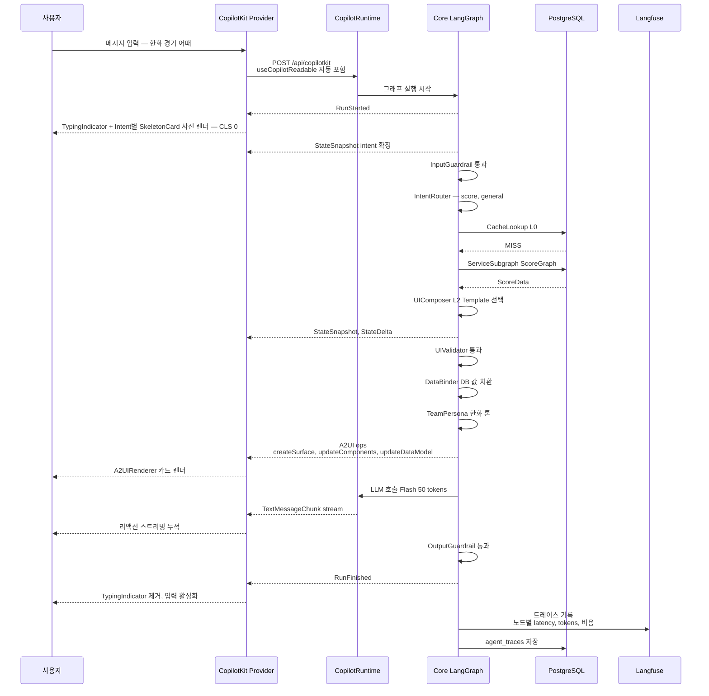

## 2. AG-UI Protocol 통신 계약

### 2.0 메시지 시퀀스 (Mermaid)



### 2.1 프론트 → 백엔드 (사용자 메시지)

CopilotKit Provider가 `/api/copilotkit` 엔드포인트에 POST, 본문에 `useCopilotReadable`로 등록된 컨텍스트가 자동 포함.

**자동 주입되는 Readable Context**
- `user.id`, `user.teamId`, `user.level`, `user.persona`
- `personalAgent.profileSummary`
- `session.recentMessages` (최근 20건)
- `currentGame` (실시간 경기 상태, 있을 때만)

### 2.2 백엔드 → 프론트 (AG-UI 메시지 스트림)

| 메시지 타입 | 용도 | 생성자 |
|-----------|------|--------|
| `RunStarted` | 그래프 시작 | LangGraph |
| `StateSnapshot` | Agent 상태 스냅샷 | LangGraph |
| `StateDelta` | 상태 변화 | LangGraph |
| `TextMessageChunk` | LLM 스트리밍 텍스트 | UIComposer |
| `ToolCall` | 프론트 함수 호출 요청 | Agent |
| A2UI ops | `createSurface`/`updateComponents`/`updateDataModel` (표준, PoC #2) | UIComposer → DataBinder |
| `RunFinished` | 그래프 종료 | LangGraph |

#### 2.2.1 A2UI 골든 샘플 (검증된 3-메시지 JSONL)

A2UI **표준 포맷**의 검증된 메시지 흐름(PoC #2, gemini-2.5-flash + `@a2ui/web_core`·`@ag-ui/a2ui-toolkit`로 실측). 순서는 `createSurface` → `updateComponents` → `updateDataModel`. 아래는 scoreboard 예시.

```jsonl
{"createSurface":{"surfaceId":"score-1","catalogId":"basic"}}
{"updateComponents":{"surfaceId":"score-1","components":[{"id":"root","component":"Column","children":["row"]},{"id":"row","component":"Row","children":["home","away"]},{"id":"home","component":"Text","text":{"path":"/home/score"}},{"id":"away","component":"Text","text":{"path":"/away/score"}}]}}
{"updateDataModel":{"surfaceId":"score-1","path":"/","value":{"home":{"score":5},"away":{"score":3}}}}
```

- 컴포넌트 노드: `id` + **`component`**(타입 키) + `children`(자식 id 배열) + 값 슬롯(`text` 등)에 `{"path":"/json/pointer"}`(RFC 6901). **루트 id는 `"root"`**.
- 데이터: `updateDataModel{path:"/", value:{...}}` 한 op로 주입 → 값 슬롯의 path가 해소(`/home/score → 5`). **값은 LLM이 만들지 않고 데이터에서만** 옴(bind-분리, PoC #2 적대조건까지 검증).
- ⚠️ 이전 1.0 문서의 `surfaceUpdate`/`beginRendering` 다이얼렉트는 실측과 달라 폐기 — 표준 3-op가 정본.
- 바인딩 출처: L1 템플릿 `{{bind:"home.score"}}` → DataBinder가 값 슬롯 `{"path":"/home/score"}`로 컴파일 (→ [a2ui-palette-schema §5.5.1](./batdi-a2ui-palette-schema.md)).

#### 2.2.2 CopilotKit 렌더러 연결

> **PoC 정정(2026-06-12)**: `createA2UIMessageRenderer` export는 `@copilotkit/react-core`(v2)에 있다. `@copilotkit/a2ui-renderer`는 `A2UIRenderer`/`A2UIProvider`/`basicCatalog`를 제공. 백엔드 연결은 `LangGraphAgent({deploymentUrl, graphId})`(NOT `LangGraphHttpAgent`), AG-UI threadId/runId는 UUID. 관측된 이벤트 시퀀스: `RUN_STARTED → TEXT_MESSAGE_START → TEXT_MESSAGE_CONTENT → TEXT_MESSAGE_END → MESSAGES_SNAPSHOT → RUN_FINISHED`.

```tsx
import { CopilotKitProvider } from "@copilotkit/react";
import { createA2UIMessageRenderer } from "@copilotkit/react-core"; // PoC: react-core(v2), not a2ui-renderer

const a2uiRenderer = createA2UIMessageRenderer({ theme: "light" });

export function AppProviders({ children }: { children: React.ReactNode }) {
  return (
    <CopilotKitProvider
      runtimeUrl="/api/copilotkit"
      renderActivityMessages={a2uiRenderer}
    >
      {children}
    </CopilotKitProvider>
  );
}
```

#### 2.2.3 A2UI 표준 v1.0 RC ↔ CopilotKit 다이얼렉트 대응 (마이그레이션 참조)

**A2UI 표준 포맷이 정본**(PoC #2 실측). 초기 문서가 가정했던 `surfaceUpdate`/`dataModelUpdate`/`beginRendering` 다이얼렉트는 실제 패키지(`@a2ui/web_core`·`@ag-ui/a2ui-toolkit`)에 없어 **폐기**했다. 표준 메시지셋(a2ui.org v1.0 RC, 프로덕션 v0.9.1):

| A2UI 표준 메시지 | 역할 | 비고 |
|------------------|------|------|
| `createSurface` | 새 surface 초기화 | `catalogId` 지정 |
| `updateComponents` | 컴포넌트 트리 갱신 | `component` 키·`children`(id 배열)·루트 `id:"root"` |
| `updateDataModel` | 데이터 주입 | `{path:"/", value:{...}}`, 값 슬롯 `{path:}` 해소 |
| `deleteSurface` | surface 제거 | MVP 미사용 |
| `actionResponse` / `callFunction` | 툴 응답 / 호출 | AG-UI `ToolResult` / `ToolCall`에 매핑 |

### 2.3 프론트 → 백엔드 (툴 응답)

`useCopilotAction`으로 등록한 프론트 함수 호출 결과를 AG-UI `ToolResult`로 회신. 예:
- `registerFavoritePlayer(playerId)`
- `toggleNotification(type)`
- `openPersonaEditor()`
- `jumpToConversation(id)`

(전체 7종 카탈로그는 [batdi-copilot-actions](./batdi-copilot-actions.md) 참조)
