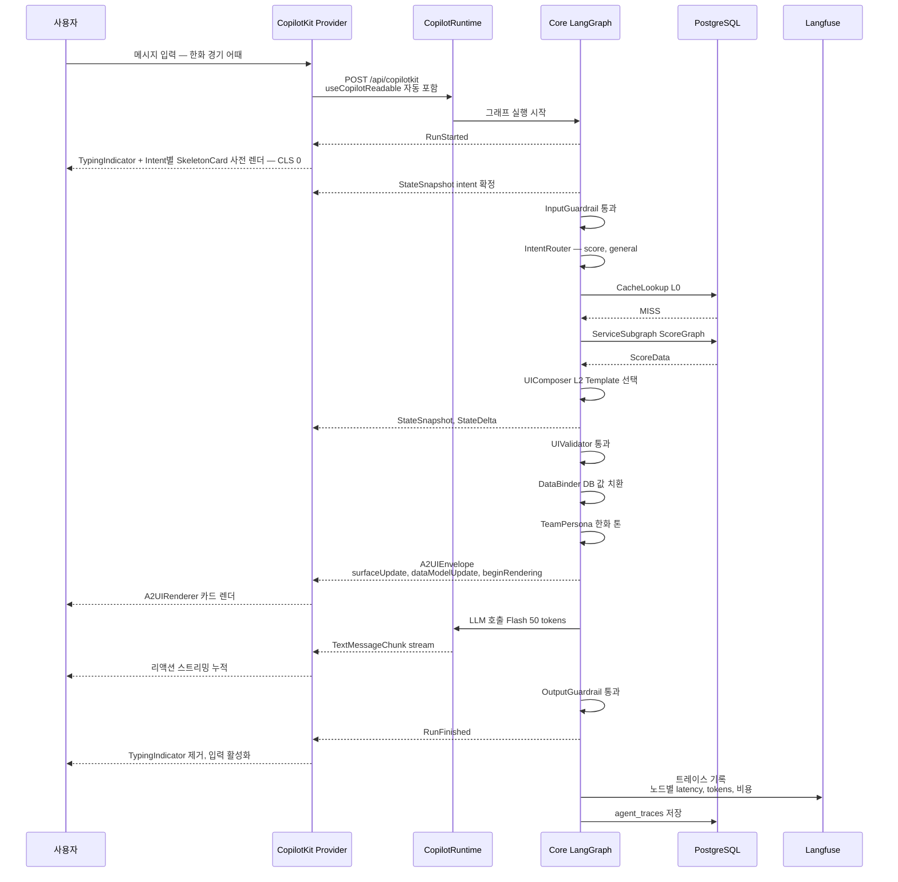

## 2. AG-UI Protocol 통신 계약

### 2.0 메시지 시퀀스 (Mermaid)

### 2.1 프론트 → 백엔드 (사용자 메시지)

CopilotKit Provider가 `/api/copilotkit` 엔드포인트에 POST, 본문에 `useCopilotReadable`로 등록된 컨텍스트가 자동 포함.

**자동 주입되는 Readable Context**
- `user.id`, `user.teamId`, `user.level`, `user.persona`
- `personalAgent.profileSummary`
- `session.recentMessages` (최근 20건)
- `currentGame` (실시간 경기 상태, 있을 때만)

### 2.2 백엔드 → 프론트 (AG-UI 메시지 스트림)

| 메시지 타입 | 용도 | 생성자 |
|-----------|------|--------|
| `RunStarted` | 그래프 시작 | LangGraph |
| `StateSnapshot` | Agent 상태 스냅샷 | LangGraph |
| `StateDelta` | 상태 변화 | LangGraph |
| `TextMessageChunk` | LLM 스트리밍 텍스트 | UIComposer |
| `ToolCall` | 프론트 함수 호출 요청 | Agent |
| `A2UIEnvelope` | `surfaceUpdate`/`dataModelUpdate`/`beginRendering` | UIComposer → DataBinder |
| `RunFinished` | 그래프 종료 | LangGraph |

### 2.3 프론트 → 백엔드 (툴 응답)

`useCopilotAction`으로 등록한 프론트 함수 호출 결과를 AG-UI `ToolResult`로 회신. 예:
- `registerFavoritePlayer(playerId)`
- `toggleNotification(type)`
- `openPersonaEditor()`
- `jumpToConversation(id)`

(전체 7종 카탈로그는 [batdi-copilot-actions](./batdi-copilot-actions.md) 참조)
