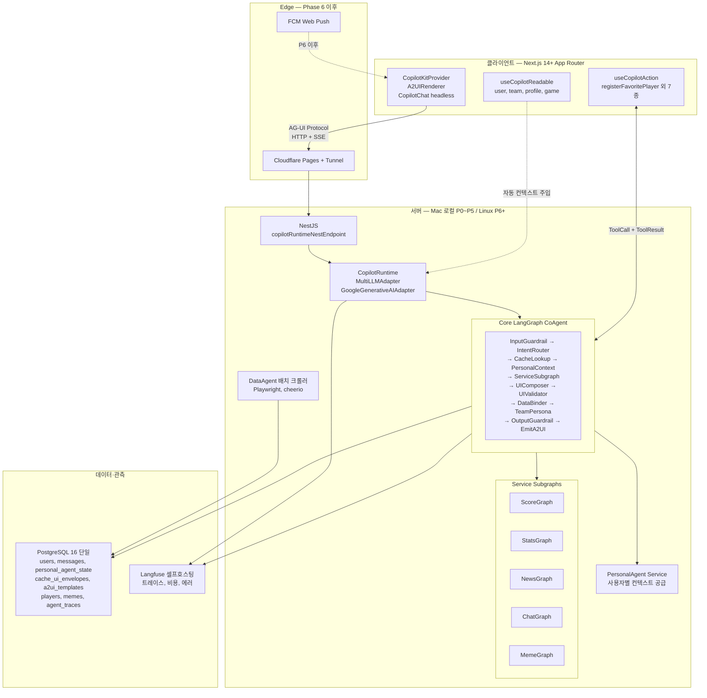
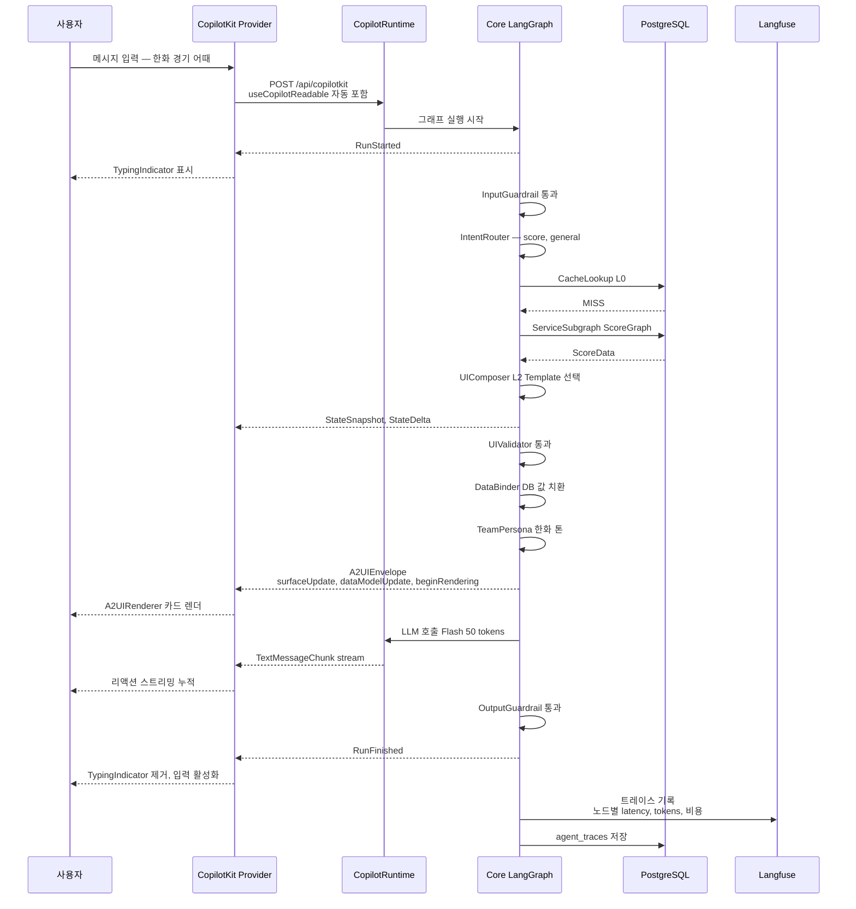
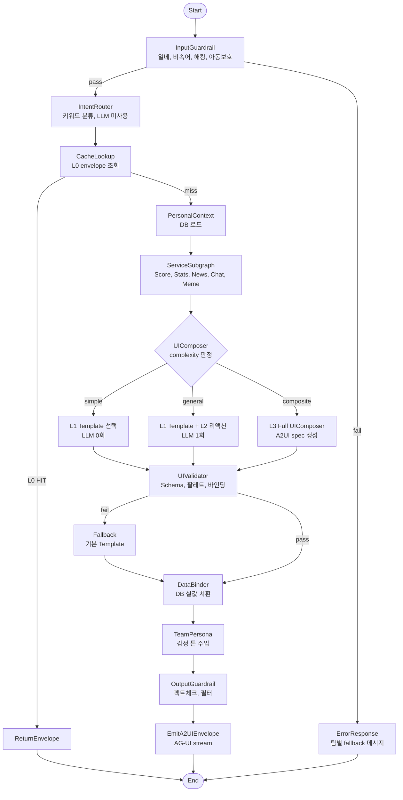
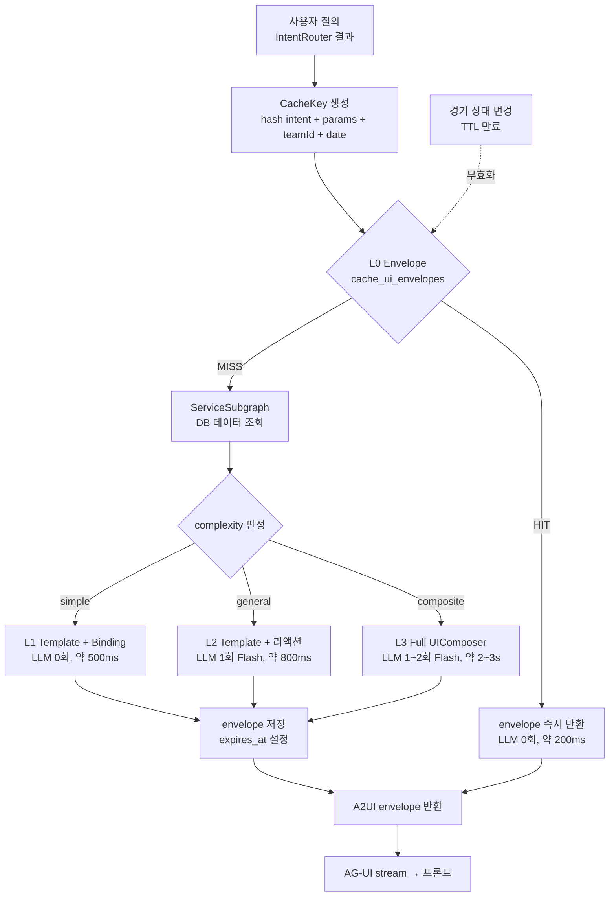
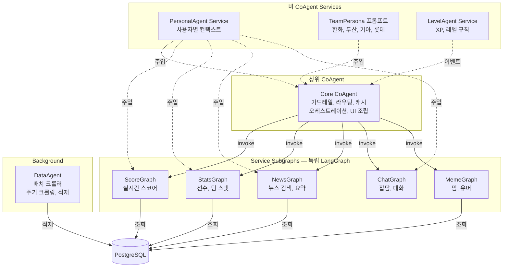

# 밧디(batdi) 시스템 아키텍처 (v1)

> 작성일: 2026-04-04
> 스코프: CopilotKit 풀스택 + LangGraph CoAgents + A2UI + AG-UI 기반 확장형 아키텍처
> 목적: 서비스 플랜과 개발계획서의 기술 기준점. 구현 전 이 문서를 먼저 갱신한다.

---

## 0. 설계 원칙

1. **표준 프로토콜 우선**: Google A2UI JSONL 스펙, CopilotKit AG-UI 프로토콜, LangGraph state-graph 표준 준수
2. **Agent 통제된 동적 UI**: LLM에게 UI 구조 선택권을 주되, Agent가 화이트리스트 팔레트·JSON Schema 검증·데이터 바인딩 강제로 통제
3. **LLM 호출 최소화**: 4단계 캐시(Envelope → Template → PartialLLM → FullLLM)로 대부분 질의는 LLM 0~1회
4. **데이터 바인딩 강제**: 모든 수치 필드는 `{{bind:"path"}}` 참조만 허용, LLM 리터럴 값 출력 금지
5. **계층적 CoAgent**: Core CoAgent가 상위 LangGraph, Service Agent는 subgraph node
6. **멀티 LLM 추상화**: Gemini 기본, LiteLLM or 자체 라우터로 다중 공급자 교체 가능
7. **Observability 내장**: Langfuse 셀프호스팅으로 Agent 트레이스·비용·에러 추적

---

## 1. 전체 시스템 토폴로지

### 1.0 시스템 구성도 (Mermaid)



### 1.1 ASCII 참조도

```
                     [Cloudflare CDN]
                            │
                  [Next.js 14+ App Router]  ── FCM Push (Phase 6)
                            │
                  ┌─────────┴──────────┐
                  │ CopilotKitProvider │
                  │  - A2UIRenderer    │
                  │  - CopilotChat     │
                  │  - useReadable     │
                  │  - useCopilotAction│
                  └─────────┬──────────┘
                            │ AG-UI Protocol (HTTP/SSE)
                            ▼
                    [Cloudflare Tunnel]
                            │
              ┌─────────────┴──────────────┐
              │      로컬 Linux PC           │
              │                              │
              │  [NestJS]                    │
              │    copilotRuntimeNestEndpoint│
              │    ├── CopilotRuntime        │
              │    │    ├── MultiLLMAdapter  │
              │    │    │    ├─ Gemini Flash │
              │    │    │    ├─ Flash-Lite   │
              │    │    │    ├─ Flash 3      │
              │    │    │    └─ Pro          │
              │    │    └── Core CoAgent     │
              │    └── Domain Services       │
              │                              │
              │  [Core LangGraph]            │
              │    ├── InputGuardrail Node   │
              │    ├── IntentRouter Node     │
              │    ├── CacheLookup Node      │
              │    ├── PersonalContext Node  │
              │    ├── ServiceSubgraphs      │
              │    │    ├── ScoreGraph       │
              │    │    ├── StatsGraph       │
              │    │    ├── NewsGraph        │
              │    │    ├── ChatGraph        │
              │    │    └── MemeGraph        │
              │    ├── TeamPersona Node (4팀)│
              │    ├── UIComposer Node       │
              │    │    ├── Template Path    │
              │    │    ├── PartialLLM Path  │
              │    │    └── FullLLM Path     │
              │    ├── UIValidator Node      │
              │    ├── DataBinder Node       │
              │    └── OutputGuardrail Node  │
              │                              │
              │  [DataAgent (배치 크롤러)]    │
              │                              │
              │  [PostgreSQL 단일 인스턴스]   │
              │    ├── users / auth          │
              │    ├── conversations/messages│
              │    ├── personal_agent_state  │
              │    ├── cache_scores/news     │
              │    ├── cache_ui_envelopes    │← A2UI envelope L0 캐시
              │    ├── a2ui_templates        │← L1 템플릿
              │    ├── players/batting/pitch │
              │    ├── memes/team_personas   │
              │    └── agent_traces          │
              │                              │
              │  [Langfuse (셀프호스팅)]      │
              │                              │
              └──────────────────────────────┘
```

---

## 2. AG-UI Protocol 통신 계약

### 2.0 메시지 시퀀스 (Mermaid)



### 2.1 프론트 → 백엔드 (사용자 메시지)

CopilotKit Provider가 `/api/copilotkit` 엔드포인트에 POST, 본문에 `useCopilotReadable`로 등록된 컨텍스트가 자동 포함.

**자동 주입되는 Readable Context**
- `user.id`, `user.teamId`, `user.level`, `user.persona`
- `personalAgent.profileSummary`
- `session.recentMessages` (최근 20건)
- `currentGame` (실시간 경기 상태, 있을 때만)

### 2.2 백엔드 → 프론트 (AG-UI 메시지 스트림)

| 메시지 타입 | 용도 | 생성자 |
|-----------|------|--------|
| `RunStarted` | 그래프 시작 | LangGraph |
| `StateSnapshot` | Agent 상태 스냅샷 | LangGraph |
| `StateDelta` | 상태 변화 | LangGraph |
| `TextMessageChunk` | LLM 스트리밍 텍스트 | UIComposer |
| `ToolCall` | 프론트 함수 호출 요청 | Agent |
| `A2UIEnvelope` | `surfaceUpdate`/`dataModelUpdate`/`beginRendering` | UIComposer → DataBinder |
| `RunFinished` | 그래프 종료 | LangGraph |

### 2.3 프론트 → 백엔드 (툴 응답)

`useCopilotAction`으로 등록한 프론트 함수 호출 결과를 AG-UI `ToolResult`로 회신. 예:
- `registerFavoritePlayer(playerId)`
- `toggleNotification(type)`
- `openPersonaEditor()`
- `jumpToConversation(id)`

---

## 3. Core LangGraph State

### 3.1 State 스키마

```typescript
type CoreState = {
  // 입력
  userMessage: string;
  userId: string;
  teamId: TeamId;

  // 가드레일
  inputGuardrailResult: GuardrailResult;
  outputGuardrailResult?: GuardrailResult;

  // 라우팅
  intent: Intent;                      // score | stats | news | chat | schedule | meme | composite
  intentConfidence: 'high' | 'default';
  complexity: 'simple' | 'general' | 'composite';

  // 캐시
  envelopeCacheKey: string;
  cacheHit: 'L0' | 'L1' | 'L2' | 'L3' | 'miss';

  // 개인화
  personalContext: PersonalContext;
  teamPersona: TeamPersonaPrompt;

  // 서비스 데이터
  serviceData: ServiceAgentOutput;     // DB 조회 결과, 바인딩 소스

  // UI
  a2uiEnvelope?: A2UIEnvelope;         // 최종 렌더링 메시지
  llmReactionText?: string;

  // 메타
  llmCallCount: number;
  traceId: string;
};
```

### 3.2 노드 흐름 (Mermaid)



### 3.3 ASCII 참조

```
[Start]
  ↓
[InputGuardrail] → fail → [ErrorResponse]
  ↓ pass
[IntentRouter] (키워드, LLM 미사용)
  ↓
[CacheLookup] → L0 HIT → [ReturnEnvelope] → [End]
  ↓ miss
[PersonalContext] (DB)
  ↓
[ServiceSubgraph] (Score/Stats/News/... — 병렬 실행 가능)
  ↓
[UIComposer]
  ├── complexity=simple → Template 선택 (LLM 0회)
  ├── complexity=general → Template + 리액션 LLM (1회, ~50 토큰)
  └── complexity=composite → FullLLM UIComposer (A2UI spec 생성)
  ↓
[UIValidator] (JSON Schema, 팔레트, 바인딩)
  ↓ fail → fallback Template
  ↓ pass
[DataBinder] (DB 실값 주입, LLM 리터럴 값 차단)
  ↓
[TeamPersona] (감정 리액션 톤 주입, LLM 필요 시)
  ↓
[OutputGuardrail]
  ↓
[EmitA2UIEnvelope]
  ↓
[End]
```

---

## 4. 4단계 캐시 아키텍처

### 4.0 캐시 결정 플로우 (Mermaid)



**TTL 정책**
- A. 스코어 경기 중: 1~5분
- B. 순위표: 1시간
- C. 선수 기본 스탯: 1일
- D. 뉴스: 30분

### 4.1 캐시 레이어

| 레벨 | 저장소 | Key | TTL | LLM | 적용 대상 |
|------|--------|-----|-----|-----|-----------|
| **L0** Envelope 캐시 | `cache_ui_envelopes` | `hash(intent, params, teamId, date)` | 1~5분 (스코어) / 1시간 (순위) / 1일 (선수 기본스탯) | 0회 | 공개·반복 질의 |
| **L1** Template + Binding | `a2ui_templates` + runtime bind | template_id + DB row | 무제한 (배포 시 고정) | 0회 | 고정 구조 카드 |
| **L2** Partial LLM (리액션) | inline 생성 | — | — | 1회 (Flash, ~50 out tokens) | 페르소나 리액션 |
| **L3** Full UIComposer | inline 생성 | — | — | 1~2회 (Flash, ~500 out tokens) | 복합·개인화·온보딩 |

### 4.2 L0 Envelope 캐시 스키마

```sql
CREATE TABLE cache_ui_envelopes (
  cache_key      VARCHAR(128) PRIMARY KEY,
  intent         VARCHAR(32) NOT NULL,
  params_hash    VARCHAR(64) NOT NULL,
  team_id        VARCHAR(20),
  envelope_jsonl TEXT NOT NULL,      -- A2UI 3-메시지 JSONL
  data_snapshot  JSONB,              -- 원본 데이터 (디버깅용)
  hit_count      INT DEFAULT 0,
  expires_at     TIMESTAMP NOT NULL,
  created_at     TIMESTAMP DEFAULT NOW()
);
CREATE INDEX idx_cache_ui_expires ON cache_ui_envelopes(expires_at);
```

**캐시 무효화**
- 스코어 변경 이벤트 → 해당 경기 관련 envelope 전체 DELETE
- 5분 배치: 만료 envelope 삭제
- Admin 수동 flush 지원

### 4.3 L1 Template 스키마

```sql
CREATE TABLE a2ui_templates (
  template_id    VARCHAR(64) PRIMARY KEY,
  intent         VARCHAR(32) NOT NULL,
  component_tree JSONB NOT NULL,     -- A2UI surfaceUpdate 구조 (바인딩 플레이스홀더 포함)
  bind_schema    JSONB NOT NULL,     -- 필요한 데이터 경로 명세
  variants       JSONB,              -- compact/emphasized 등
  version        INT DEFAULT 1,
  created_at     TIMESTAMP DEFAULT NOW()
);
```

**템플릿 예시 (`score_compact` 템플릿)**
```json
{
  "surfaceUpdate": {
    "surfaceId": "result",
    "components": [
      {"id":"sb","type":"scoreboardWidget","props":{
        "homeTeam":"{{bind:data.home.name}}",
        "awayTeam":"{{bind:data.away.name}}",
        "homeScore":"{{bind:data.home.score}}",
        "awayScore":"{{bind:data.away.score}}",
        "inning":"{{bind:data.inning}}",
        "status":"{{bind:data.status}}"
      }}
    ]
  },
  "bindSchema": {
    "data.home.name": "string",
    "data.home.score": "number",
    "data.away.name": "string",
    "data.away.score": "number",
    "data.inning": "string",
    "data.status": "enum:live|ended|scheduled"
  }
}
```

---

## 5. A2UI Component Palette

### 5.1 팔레트 설계 원칙 (Hybrid)

**원자 컴포넌트**(범용) + **도메인 widget**(야구 특화) 동시 제공. LLM은 도메인 widget 우선 선택, 없으면 원자로 조합.

### 5.2 원자 컴포넌트

| 타입 | 프롭 |
|------|------|
| `column` / `row` / `grid` | children, gap, padding, align |
| `card` | children, variant(default/emphasized/muted), padding |
| `text` | content, variant(title/subtitle/body/caption), weight, tone |
| `badge` / `chip` | label, tone(info/success/warning/danger/team) |
| `divider` | orientation |
| `table` | rows, cols, tabularNums |
| `button` | label, variant, action |
| `accordion` / `tabs` | items |
| `image` / `avatar` | src, alt, size |

### 5.3 야구 도메인 widget

| widget | 필수 바인딩 |
|--------|-----------|
| `scoreboardWidget` | homeTeam, awayTeam, homeScore, awayScore, inning, status |
| `battingLineWidget` | player, ab, h, hr, rbi, avg |
| `pitchingLineWidget` | player, ip, h, er, k, bb, era, pitches |
| `standingsRowWidget` | rank, team, w, l, pct, gb |
| `playerChipWidget` | name, team, position, number |
| `gameScheduleWidget` | date, home, away, venue, time |
| `trendSparkline` | data[], type(era/avg/war) |
| `headToHeadWidget` | playerA, playerB, stats |
| `newsItemWidget` | title, source, url, publishedAt |
| `levelProgressWidget` | currentLevel, xp, nextLevelXp |

### 5.4 JSON Schema 검증 (UIValidator)

```typescript
const A2UISchema = {
  surfaceUpdate: {
    surfaceId: 'string',
    components: {
      type: 'array',
      maxDepth: 4,                     // 중첩 최대 4단계
      maxNodes: 30,                    // 총 노드 30개 제한
      itemSchema: {
        type: { enum: ALLOWED_TYPES }, // 화이트리스트 외 차단
        props: 'validated per type'
      }
    }
  },
  dataModelUpdate: { /* ... */ },
  beginRendering: { /* ... */ }
};
```

**검증 실패 시 Fallback 정책**
1. LLM 재호출 1회 (오류 메시지 프롬프트 주입)
2. 재실패 → 해당 intent의 기본 L1 Template으로 대체
3. 트레이스에 `llm_ui_invalid` 이벤트 기록 → Langfuse

### 5.5 데이터 바인딩 규칙

- 모든 수치·문자열 실값 필드는 `{{bind:"data.path"}}` 또는 `{{llm.reaction}}` 참조만 허용
- 리터럴 허용: static label (e.g. `"경기 종료"`), styling 값
- Validator가 모든 value를 정규식 검사: `/\{\{(bind|llm):[^}]+\}\}/` 또는 whitelist
- 위반 시 차단 + 트레이스 기록

---

## 6. LLM Routing (MultiLLMAdapter)

### 6.1 공급자 추상화

```typescript
interface LLMAdapter {
  name: string;
  models: LLMModel[];
  generate(req: LLMRequest): Promise<LLMResponse>;
  stream(req: LLMRequest): AsyncIterable<TextChunk>;
}

// 구현체
- GeminiAdapter (2.5 Flash/Flash-Lite/Pro, 3 Flash)
- (Phase 6+) ClaudeAdapter, GPTAdapter — 필요 시
```

### 6.2 모델 라우팅 매트릭스

| 사용처 | 모델 | 이유 |
|--------|------|------|
| L2 Partial 리액션 (50 out tokens) | **Gemini 2.5 Flash** | 최저가 페르소나 |
| L3 UIComposer (500 out tokens) | **Gemini 2.5 Flash** | A2UI JSONL 출력 품질 + 가격 |
| 의미적 가드레일 판정 | **Gemini 2.5 Flash-Lite** | 최저가 분류 |
| Search Grounding (단일) | **Gemini 3 Flash** | 무료 할당 5K/월 우선 소진 |
| Search Grounding (복합) | **Gemini 2.5 Flash** | 프롬프트당 과금 유리 |
| Batch 프로필 요약 | **Flash-Lite Batch** | 50% 할인 |
| 심층 분석 (추후) | **Gemini 2.5 Pro** | 품질 |

### 6.3 Gemini Context Caching

시스템 프롬프트(Team Persona + System Base + A2UI 팔레트 정의)는 **Context Caching API**로 캐시. 입력 토큰 75% 할인.

- 팀당 1 cache entry (4팀 × ~2000 토큰 시스템 프롬프트)
- TTL 1시간 (자동 갱신)
- 캐시 히트 시 재사용 → 실제 과금은 `user_message + personal_context`만

---

## 7. CoAgents 계층 구조

### 7.0 계층 구조도 (Mermaid)



### 7.1 Core CoAgent (상위 그래프)

- **역할**: 사용자 메시지 진입점, 가드레일·의도분류·캐시·오케스트레이션·응답조립
- **노출 상태**: `intent`, `cacheHit`, `complexity`, `a2uiEnvelope` (프론트 `useCoAgentState`로 관찰)
- **CoAgent 특성 사용**: `StateSnapshot`/`StateDelta`로 진행률 UI 표시

### 7.2 Service Subgraphs

| Subgraph | 역할 | 인터페이스 |
|----------|------|----------|
| `ScoreGraph` | 실시간 스코어 조회 | `{gameId?} → ScoreData` |
| `StatsGraph` | 선수/팀 스탯 | `{playerId|teamId, statType} → StatsData` |
| `NewsGraph` | 뉴스 검색·요약 | `{query, teamId} → NewsData[]` |
| `ChatGraph` | 잡담 | `{message, personalCtx} → reactionText` |
| `MemeGraph` | 밈 응답 | `{teamId, trigger} → meme` |

각 subgraph는 독립 LangGraph. Core에서 `.invoke()`로 호출.

### 7.3 Personal Agent (비 CoAgent)

사용자별 컨텍스트 공급자. LangGraph node가 아닌 **Service 클래스**로 구현하여 모든 subgraph에 주입.

```typescript
class PersonalAgent {
  async buildContext(userId: string, gameState?: GameState): Promise<PersonalContext>
  async learnFromConversation(messages: Message[]): Promise<void>
  async detectFavoritePlayers(message: string): Promise<void>
}
```

---

## 8. 프론트 `useCopilotAction` 도메인 함수

LLM이 직접 호출 가능한 프론트 함수 (툴콜):

| Action | 파라미터 | 효과 |
|--------|---------|-----|
| `registerFavoritePlayer` | `playerId` | 관심 선수 등록 + DB 반영 |
| `openPersonaEditor` | — | 설정 모달 오픈 |
| `jumpToConversation` | `conversationId` | 대화 페이지 이동 |
| `toggleNotification` | `type` | 푸시 알림 on/off |
| `showPlayerDetail` | `playerId` | 선수 상세 오버레이 |
| `requestScoreRefresh` | `gameId` | 스코어 강제 갱신 |
| `showTeamComparison` | `teamA, teamB` | 팀 비교 뷰 |

모든 action은 백엔드 검증 API와 1:1 매핑. LLM 악용 방지.

---

## 9. `useCopilotReadable` 자동 컨텍스트

프론트에서 다음 상태를 자동으로 Agent에 노출:

```typescript
useCopilotReadable({ description: "로그인한 사용자 기본 정보", value: user });
useCopilotReadable({ description: "선택한 팀", value: teamId });
useCopilotReadable({ description: "사용자 레벨과 XP", value: { level, xp } });
useCopilotReadable({ description: "개인화 페르소나 힌트", value: personalProfile });
useCopilotReadable({ description: "현재 경기 상황", value: currentGame });
useCopilotReadable({ description: "최근 대화 요약", value: recentSummary });
```

→ 프롬프트 엔지니어링 최소화. Agent는 자동으로 이 컨텍스트를 받음.

---

## 10. DB 스키마 (확장)

### 10.1 신규 테이블

```sql
-- A2UI 캐시
CREATE TABLE cache_ui_envelopes (...);
CREATE TABLE a2ui_templates (...);

-- Agent 트레이스 (Langfuse 동기화 전 버퍼)
CREATE TABLE agent_traces (
  trace_id       UUID PRIMARY KEY,
  user_id        UUID REFERENCES users(id),
  conversation_id UUID REFERENCES conversations(id),
  intent         VARCHAR(32),
  complexity     VARCHAR(16),
  cache_hit      VARCHAR(8),
  llm_calls      INT DEFAULT 0,
  tokens_in      INT DEFAULT 0,
  tokens_out     INT DEFAULT 0,
  duration_ms    INT,
  error          TEXT,
  created_at     TIMESTAMP DEFAULT NOW()
);
CREATE INDEX idx_traces_user_created ON agent_traces(user_id, created_at);
CREATE INDEX idx_traces_intent ON agent_traces(intent);

-- 툴콜 로그
CREATE TABLE tool_call_logs (
  id             SERIAL PRIMARY KEY,
  trace_id       UUID REFERENCES agent_traces(trace_id),
  action_name    VARCHAR(64),
  params         JSONB,
  result         JSONB,
  duration_ms    INT,
  created_at     TIMESTAMP DEFAULT NOW()
);
```

### 10.2 messages 테이블 확장

```sql
ALTER TABLE messages
  ADD COLUMN a2ui_envelope JSONB,     -- 저장된 A2UI spec (감사·재생용)
  ADD COLUMN trace_id UUID REFERENCES agent_traces(trace_id);
```

---

## 11. 관측·디버깅 (Langfuse)

### 11.1 트레이싱 대상

- LangGraph 전체 실행 (노드별 latency, I/O)
- LLM 호출 (모델, 토큰, 비용)
- 캐시 히트/미스
- UIValidator 실패
- 가드레일 위반
- 툴콜 실행

### 11.2 Langfuse 배포

- 로컬 Docker로 배포 (Phase 1부터)
- Phase 6 이관 시 Linux PC에 함께 셀프호스팅
- 비용: 0원

### 11.3 Admin 대시보드 연동

`/admin/monitoring`에서 Langfuse API로 다음 지표 렌더:
- 일일 LLM 호출 수·비용
- 캐시 히트율 (L0/L1/L2/L3 분포)
- Intent별 평균 latency
- UIValidator 실패율
- 가드레일 위반 TOP 10

---

## 12. 비용 모델 (재계산)

### 12.1 가정

- MVP 100명, 인당 평균 15건/일 → 1,500건/일, 45,000건/월
- 질의 분포: L0 60% / L1 10% / L2 20% / L3 10%
- L2 평균 50 out tokens, L3 평균 500 out tokens
- Gemini Context Caching 입력 75% 할인 적용

### 12.2 월간 LLM 호출 추정

| 레벨 | 호출 수 | 모델 | 토큰 (in/out) | 월 비용 |
|------|---------|------|--------------|---------|
| L0 | 27,000 | — | 0 | ₩0 |
| L1 | 4,500 | — | 0 | ₩0 |
| L2 | 9,000 | Flash | ~800/50 (캐시 히트 입력) | ~$0.65 → **₩900** |
| L3 | 4,500 | Flash | ~1500/500 | ~$2.90 → **₩4,000** |
| Guardrail Semantic | ~2,000 | Flash-Lite | ~300/20 | ~$0.05 → **₩70** |
| Batch 프로필 요약 | ~60 | Flash-Lite Batch | ~3000/200 | ~$0.01 → **₩15** |
| **합계** | | | | **~₩5,000** |

### 12.3 Search Grounding

- 무료 할당 우선: Gemini 3 Flash 5,000건/월, 2.5 Flash 500 RPD
- 예상 유료 초과: **~₩5,000** 이내

### 12.4 총 비용 (MVP 100명)

| 항목 | 월 비용 |
|------|--------|
| LLM 토큰 (L2+L3+가드레일+요약) | ~₩5,000 |
| Search Grounding | ~₩5,000 |
| Langfuse 셀프호스팅 | ₩0 |
| CopilotKit (오픈소스 self-host) | ₩0 |
| 인프라 (로컬 PC + Cloudflare) | ₩0 |
| 도메인 | ~₩1,000 |
| **합계** | **~₩10,000 ~ ₩15,000** |

기존 플랜(~₩5,000~₩20,000)과 동급. A2UI·CopilotKit 도입으로 비용 증가 없음.

---

## 13. 기술 스택 확정

| 영역 | 선택 | 버전 |
|------|------|------|
| 프론트 프레임워크 | **Next.js 14+ App Router** | latest |
| UI 라이브러리 | React 18 + Radix UI + shadcn/ui | latest |
| 스타일 | Tailwind CSS + CSS Variables (design tokens) | latest |
| 상태관리 | Zustand + CopilotKit state bridge | latest |
| Agent UI | **CopilotKit** (@copilotkit/react-core, @copilotkit/a2ui-renderer) | latest |
| 백엔드 | **NestJS** | 10+ |
| Agent Runtime | **CopilotRuntime** (copilotRuntimeNestEndpoint) | latest |
| Agent Orchestration | **LangGraph.js** | latest |
| LLM 기본 | Gemini 2.5 Flash/Flash-Lite + 3 Flash (+ Context Caching) | — |
| LLM 어댑터 | `GoogleGenerativeAIAdapter` + MultiLLMAdapter 자체 | latest |
| DB | **PostgreSQL 16 (단일 인스턴스)** | 16 |
| Observability | **Langfuse (셀프호스팅)** | latest |
| 크롤링 | Playwright (Stealth) + cheerio | latest |
| 인증 (로컬) | 이메일 + JWT + AuthProvider 추상화 | — |
| 인증 (P6+) | Google OAuth 어댑터 교체 | — |
| 푸시 (로컬) | Web Push + VAPID | — |
| 푸시 (P6+) | FCM 어댑터 교체 | — |
| 인프라 (P6+) | Cloudflare Tunnel + Pages, 로컬 Linux PC | — |

---

## 14. 결정 이력 (ADR 요약)

| # | 결정 | 근거 |
|---|------|------|
| ADR-001 | CopilotKit 풀스택 채택 | 확장성·표준·생태계. UI 구조 LLM 결정권은 데이터 환각과 무관 |
| ADR-002 | LangGraph 전면 전환 | CoAgents 1급 지원, state machine 표현력, CopilotKit 통합 밀도 |
| ADR-003 | Next.js 14+ App Router | CopilotKit 공식 예제 중심, SSR/RSC, 장기 확장성 |
| ADR-004 | A2UI Hybrid 팔레트 | 원자+도메인 widget 동시 제공, LLM 선택 효율성 |
| ADR-005 | 계층적 CoAgent | Core 상위 그래프 + Service subgraph, 개별 복잡도 분리 |
| ADR-006 | MultiLLMAdapter | Gemini 기본, 장기 멀티 LLM 교체 용이성 |
| ADR-007 | Langfuse 셀프호스팅 | 오픈소스·비용 0·프라이버시 |
| ADR-008 | 4단계 캐시 구조 | LLM 호출 60~70% 감소, 비용·latency 동시 최적화 |
| ADR-009 | 데이터 바인딩 강제 (`{{bind:...}}`) | LLM 리터럴 값 차단으로 환각 원천 봉쇄 |
| ADR-010 | Semantic Cache / Persona Reaction Cache 미도입 (MVP) | 검증 부족. Phase 6 이후 효용 측정 후 재검토 |

---

*v1 — 구현 진행하며 ADR 추가·수정. 기술 결정은 이 문서를 단일 진실 원천(SSOT)으로 삼는다.*
