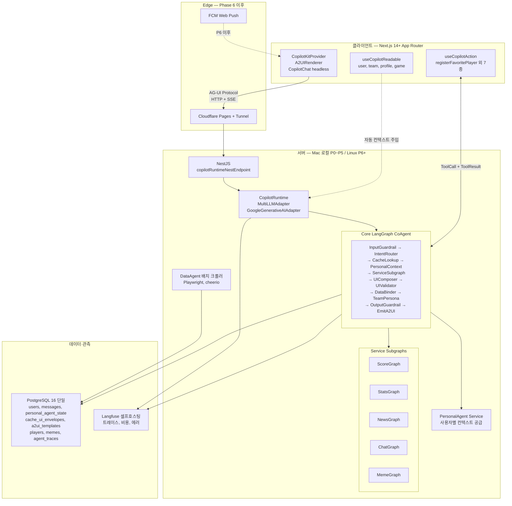
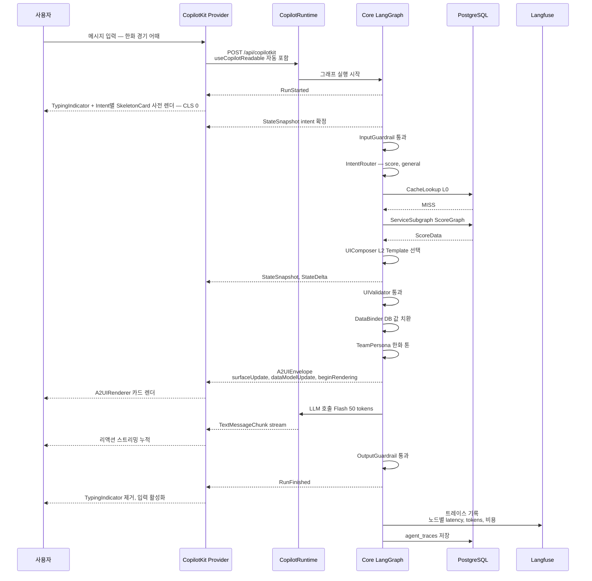
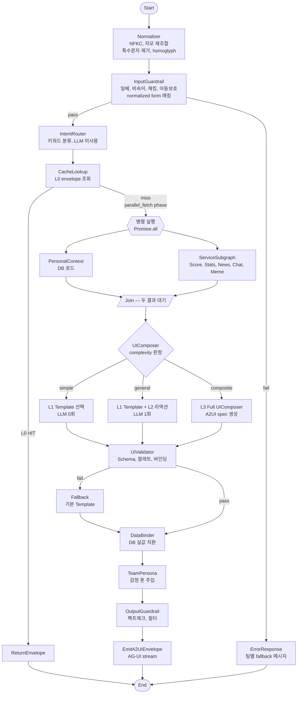
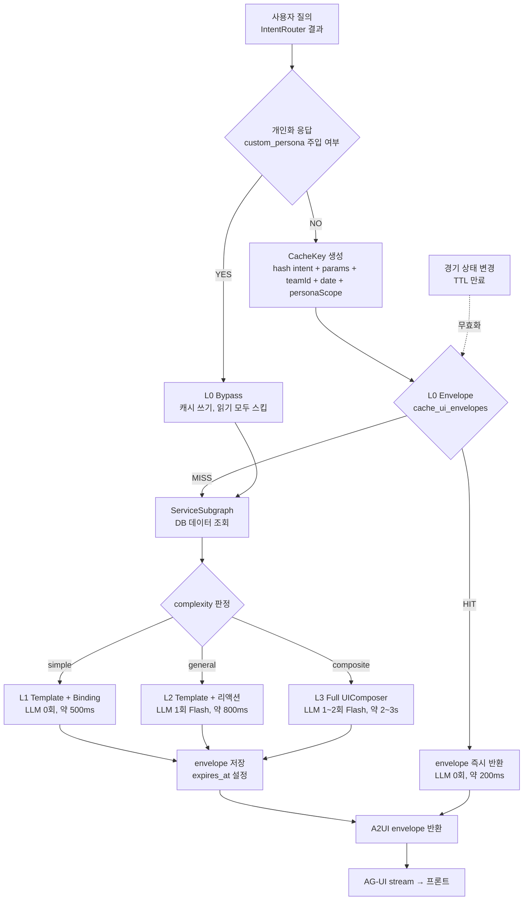
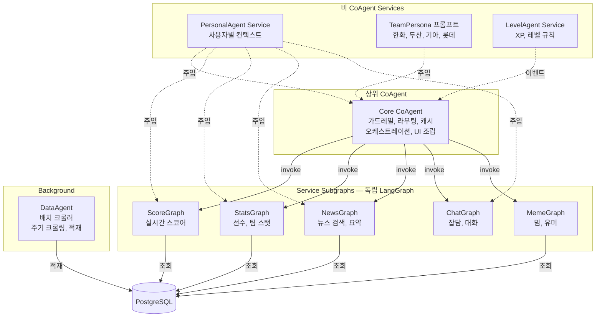

# 밧디(batdi) 시스템 아키텍처 (v1)

> 작성일: 2026-04-04
> 스코프: CopilotKit 풀스택 + LangGraph CoAgents + A2UI + AG-UI 기반 확장형 아키텍처
> 목적: 서비스 플랜과 개발계획서의 기술 기준점. 구현 전 이 문서를 먼저 갱신한다.

---

## 0. 설계 원칙

1. **표준 프로토콜 우선**: Google A2UI JSONL 스펙, CopilotKit AG-UI 프로토콜, LangGraph state-graph 표준 준수
2. **Agent 통제된 동적 UI**: LLM에게 UI 구조 선택권을 주되, Agent가 화이트리스트 팔레트·JSON Schema 검증·데이터 바인딩 강제로 통제
3. **LLM 호출 최소화**: 4단계 캐시(Envelope → Template → PartialLLM → FullLLM)로 대부분 질의는 LLM 0~1회
4. **데이터 바인딩 강제**: 모든 수치 필드는 `{{bind:"path"}}` 참조만 허용, LLM 리터럴 값 출력 금지
5. **계층적 CoAgent**: Core CoAgent가 상위 LangGraph, Service Agent는 subgraph node
6. **멀티 LLM 추상화**: Gemini 기본, LiteLLM or 자체 라우터로 다중 공급자 교체 가능
7. **Observability 내장**: Langfuse 셀프호스팅으로 Agent 트레이스·비용·에러 추적

---

## 1. 전체 시스템 토폴로지

### 1.0 시스템 구성도 (Mermaid)



### 1.1 ASCII 참조도

```
                     [Cloudflare CDN]
                            │
                  [Next.js 14+ App Router]  ── FCM Push (Phase 6)
                            │
                  ┌─────────┴──────────┐
                  │ CopilotKitProvider │
                  │  - A2UIRenderer    │
                  │  - CopilotChat     │
                  │  - useReadable     │
                  │  - useCopilotAction│
                  └─────────┬──────────┘
                            │ AG-UI Protocol (HTTP/SSE)
                            ▼
                    [Cloudflare Tunnel]
                            │
              ┌─────────────┴──────────────┐
              │      로컬 Linux PC           │
              │                              │
              │  [NestJS]                    │
              │    copilotRuntimeNestEndpoint│
              │    ├── CopilotRuntime        │
              │    │    ├── MultiLLMAdapter  │
              │    │    │    ├─ Gemini Flash │
              │    │    │    ├─ Flash-Lite   │
              │    │    │    ├─ Flash 3      │
              │    │    │    └─ Pro          │
              │    │    └── Core CoAgent     │
              │    └── Domain Services       │
              │                              │
              │  [Core LangGraph]            │
              │    ├── InputGuardrail Node   │
              │    ├── IntentRouter Node     │
              │    ├── CacheLookup Node      │
              │    ├── PersonalContext Node  │
              │    ├── ServiceSubgraphs      │
              │    │    ├── ScoreGraph       │
              │    │    ├── StatsGraph       │
              │    │    ├── NewsGraph        │
              │    │    ├── ChatGraph        │
              │    │    └── MemeGraph        │
              │    ├── TeamPersona Node (4팀)│
              │    ├── UIComposer Node       │
              │    │    ├── Template Path    │
              │    │    ├── PartialLLM Path  │
              │    │    └── FullLLM Path     │
              │    ├── UIValidator Node      │
              │    ├── DataBinder Node       │
              │    └── OutputGuardrail Node  │
              │                              │
              │  [DataAgent (배치 크롤러)]    │
              │                              │
              │  [PostgreSQL 단일 인스턴스]   │
              │    ├── users / auth          │
              │    ├── conversations/messages│
              │    ├── personal_agent_state  │
              │    ├── cache_scores/news     │
              │    ├── cache_ui_envelopes    │← A2UI envelope L0 캐시
              │    ├── a2ui_templates        │← L1 템플릿
              │    ├── players/batting/pitch │
              │    ├── memes/team_personas   │
              │    └── agent_traces          │
              │                              │
              │  [Langfuse (셀프호스팅)]      │
              │                              │
              └──────────────────────────────┘
```

---

## 2. AG-UI Protocol 통신 계약

### 2.0 메시지 시퀀스 (Mermaid)



### 2.1 프론트 → 백엔드 (사용자 메시지)

CopilotKit Provider가 `/api/copilotkit` 엔드포인트에 POST, 본문에 `useCopilotReadable`로 등록된 컨텍스트가 자동 포함.

**자동 주입되는 Readable Context**
- `user.id`, `user.teamId`, `user.level`, `user.persona`
- `personalAgent.profileSummary`
- `session.recentMessages` (최근 20건)
- `currentGame` (실시간 경기 상태, 있을 때만)

### 2.2 백엔드 → 프론트 (AG-UI 메시지 스트림)

| 메시지 타입 | 용도 | 생성자 |
|-----------|------|--------|
| `RunStarted` | 그래프 시작 | LangGraph |
| `StateSnapshot` | Agent 상태 스냅샷 | LangGraph |
| `StateDelta` | 상태 변화 | LangGraph |
| `TextMessageChunk` | LLM 스트리밍 텍스트 | UIComposer |
| `ToolCall` | 프론트 함수 호출 요청 | Agent |
| `A2UIEnvelope` | `surfaceUpdate`/`dataModelUpdate`/`beginRendering` | UIComposer → DataBinder |
| `RunFinished` | 그래프 종료 | LangGraph |

### 2.3 프론트 → 백엔드 (툴 응답)

`useCopilotAction`으로 등록한 프론트 함수 호출 결과를 AG-UI `ToolResult`로 회신. 예:
- `registerFavoritePlayer(playerId)`
- `toggleNotification(type)`
- `openPersonaEditor()`
- `jumpToConversation(id)`

---

## 3. Core LangGraph State

### 3.1 State 스키마

```typescript
type CoreState = {
  // 입력
  userMessage: string;                 // 원문 (저장·LLM 전달용)
  userMessageNormalized: string;       // 필터 매칭용 normalized form
  userMessageDisplay: string;          // 화면 표시용 NFKC 정규화 form
  userId: string;
  teamId: TeamId;

  // 가드레일
  inputGuardrailResult: GuardrailResult;
  outputGuardrailResult?: GuardrailResult;

  // 라우팅
  intent: Intent;                      // score | stats | news | chat | schedule | meme | composite
  intentConfidence: 'high' | 'default';
  complexity: 'simple' | 'general' | 'composite';

  // 캐시
  envelopeCacheKey: string;
  cacheHit: 'L0' | 'L1' | 'L2' | 'L3' | 'miss';

  // 개인화
  personalContext: PersonalContext;
  teamPersona: TeamPersonaPrompt;

  // 서비스 데이터 — LLM 프롬프트용 요약과 DataBinder용 전체를 분리 (§3.5 Payload 최적화)
  serviceDataSummary: ServiceSummary;  // LLM 주입용 경량 (예: Top5 플레이어, 스코어 핵심 지표 — <1KB)
  serviceDataRef: string;              // 전체 원본 핸들 (Map에 저장, State 밖)
  // ServiceSubgraph 내부에서만 전체 데이터 접근. 외부 노드는 Summary만 참조.

  // UI
  a2uiEnvelope?: A2UIEnvelope;         // 최종 렌더링 메시지
  llmReactionText?: string;

  // 병렬 실행 제어
  ioPhase: 'cache' | 'parallel_fetch' | 'sequential_compose';
  parallelResults: {
    personalContext?: PersonalContext;
    serviceDataSummary?: ServiceSummary;  // full payload는 별도 Store
  };

  // 메타
  llmCallCount: number;
  traceId: string;
};
```

### 3.2 노드 흐름 (Mermaid)



**병렬 실행 규칙**
- A. `CacheLookup` L0 MISS 이후 `PersonalContext`와 `ServiceSubgraph`는 **의존성 없음** → LangGraph `add_edge` 분기로 동시 디스패치
- B. 두 노드 완료 시 `Join` 노드에서 state 병합 후 `UIComposer` 진입
- C. `ServiceSubgraph` 내부에서도 외부 I/O와 DB 조회는 `Promise.all`로 병렬화
- D. 예상 개선: L2 경로 800ms → 500~600ms, L3 경로 2~3s → 1.5~2s

### 3.3 ASCII 참조

```
[Start]
  ↓
[Normalizer] (NFKC + 자모 재조합 + 특수문자 제거 + homoglyph)
  ↓
[InputGuardrail] (normalized form 매칭) → fail → [ErrorResponse]
  ↓ pass
[IntentRouter] (키워드, LLM 미사용)
  ↓
[CacheLookup] → L0 HIT → [ReturnEnvelope] → [End]
  ↓ miss (parallel_fetch phase)
  ├─→ [PersonalContext] (DB) ─┐
  └─→ [ServiceSubgraph] ──────┤  Promise.all
                              ↓
                         [Join — state 병합]
                              ↓
[UIComposer]
  ├── complexity=simple → Template 선택 (LLM 0회)
  ├── complexity=general → Template + 리액션 LLM (1회, ~50 토큰)
  └── complexity=composite → FullLLM UIComposer (A2UI spec 생성)
  ↓
[UIValidator] (JSON Schema, 팔레트, 바인딩)
  ↓ fail → fallback Template
  ↓ pass
[DataBinder] (DB 실값 주입, LLM 리터럴 값 차단)
  ↓
[TeamPersona] (감정 리액션 톤 주입, LLM 필요 시)
  ↓
[OutputGuardrail]
  ↓
[EmitA2UIEnvelope]
  ↓
[End]
```

### 3.4 Normalizer 상세

정규식 기반 필터는 `노_무현`, `놐무현`, `ㄴㅁㅎ`, `노🔥무현`처럼 띄어쓰기·특수문자·이모지·자모로 쉽게 우회된다. **InputGuardrail 앞단에 전처리 노드 추가**하여 필터 매칭용 정규화 폼을 만든다.

**처리 파이프라인**

| 단계 | 처리 | 예시 |
|------|------|------|
| A. NFKC 정규화 | 전각/반각, 호환 문자 통일 | `ｎｏ` → `no` |
| B. 공백·zero-width 제거 | 스페이스, 탭, ZWSP(`\u200b`) | `노 무 현` → `노무현` |
| C. 구분자·이모지 제거 | `._-·∙•*~/()[]{}`, 이모지 전량 | `노.무🔥현` → `노무현` |
| D. 반복 문자 축소 | 3회 이상 반복 → 1회 | `노오오오무현` → `노무현` |
| E. 한글 자모 재조합 | 초성·중성·종성 분리 입력 정규화 | `ㄴㅇㅁㅜㅎㅕㄴ` → `노무현` |
| F. Homoglyph 치환 | 숫자·유사자 매핑 | `놐`→`노`, `O`→`o`, `l`→`1` 역방향 |

**State 저장 규칙**

- `userMessage`: **원문 그대로** (LLM 전달용, 저장용)
- `userMessageDisplay`: NFKC만 적용 (화면 표시용)
- `userMessageNormalized`: 전체 파이프라인 적용 (필터 매칭용, **사용자 노출 금지**)

**필터 적용**

```typescript
class IlbeMimFilter {
  check(normalized: string): FilterResult {
    for (const pattern of this.patterns) {
      if (pattern.test(normalized)) return { blocked: true, type: 'ilbe' };
    }
    return { blocked: false };
  }
}

// 사용 시
const result = filter.check(state.userMessageNormalized);
// displayForm은 저장·표시에만, LLM에는 원본 전달
```

**성능**: Normalizer 전체 파이프라인 <1ms (500자 메시지 기준).

### 3.5 ServiceData Payload 분리 (State Bloat 방지)

**문제**: StatsGraph가 수십 명 선수 레코드를, NewsGraph가 긴 기사 배열을 긁어와 serviceData에 담으면 State가 수백 KB까지 부풀고, LangGraph 노드마다 복사되어 메모리를 잡아먹는다. 프롬프트에 그대로 주입하면 토큰 낭비 + LLM 집중력 저하.

**분리 원칙**

| 영역 | 저장 위치 | 크기 | 용도 |
|------|----------|------|------|
| `serviceDataSummary` | State (CoreState) | < 1KB | LLM 프롬프트 주입 (핵심 지표만: 타율 Top5, 스코어 요약 3필드) |
| 전체 원본 payload | **ServiceDataStore** (요청 스코프 Map, State 밖) | 제한 없음 | DataBinder가 `serviceDataRef` 핸들로 조회해 A2UI 바인딩 |

**전처리 로직 (ServiceSubgraph 내부)**

```typescript
// subgraph 내 종단 노드
async function finalize(fullData: PlayerStats[]): Promise<SubgraphOutput> {
  const ref = store.put(fullData);  // UUID 핸들 발급
  const summary: ServiceSummary = {
    type: 'stats',
    highlights: fullData.slice(0, 5).map(p => ({
      name: p.name, avg: p.avg, hr: p.hr   // LLM이 쓸 핵심 지표만
    })),
    totalCount: fullData.length,
    // 긴 텍스트·비핵심 필드 제외
  };
  return { serviceDataSummary: summary, serviceDataRef: ref };
}
```

**규칙**
- **State에 실리는 serviceDataSummary는 최대 1KB** (검증 노드가 size 초과 시 잘라냄)
- **LLM 프롬프트는 summary만 참조**. 전체 payload를 프롬프트에 넣는 것 금지.
- **DataBinder만 store에서 full payload 꺼내씀** → `{{bind:"data.path"}}` 해석 시 ref 경유
- 요청 종료 시 store 엔트리 자동 GC

---

## 4. 4단계 캐시 아키텍처

### 4.0 캐시 결정 플로우 (Mermaid)



**TTL 정책**
- A. 스코어 경기 중: 1~5분
- B. 순위표: 1시간
- C. 선수 기본 스탯: 1일
- D. 뉴스: 30분

### 4.1 캐시 레이어

| 레벨 | 저장소 | Key | TTL | LLM | 적용 대상 |
|------|--------|-----|-----|-----|-----------|
| **L0** Envelope 캐시 | `cache_ui_envelopes` | `hash(intent, params, teamId, date, personaScope)` | 1~5분 (스코어) / 1시간 (순위) / 1일 (선수 기본스탯) | 0회 | **비개인화** 공개·반복 질의만 |
| **L1** Template + Binding | `a2ui_templates` + runtime bind | template_id + DB row | 무제한 (배포 시 고정) | 0회 | 고정 구조 카드 |
| **L2** Partial LLM (리액션) | inline 생성 | — | — | 1회 (Flash, ~50 out tokens) | 페르소나 리액션 |
| **L3** Full UIComposer | inline 생성 | — | — | 1~2회 (Flash, ~500 out tokens) | 복합·개인화·온보딩 |

### 4.2 L0 Envelope 캐시 스키마

```sql
CREATE TABLE cache_ui_envelopes (
  cache_key      VARCHAR(128) PRIMARY KEY,
  intent         VARCHAR(32) NOT NULL,
  params_hash    VARCHAR(64) NOT NULL,
  team_id        VARCHAR(20),
  persona_scope  VARCHAR(16) NOT NULL,  -- 'default' | 'team_only' (개인화 응답은 저장 금지)
  envelope_jsonl TEXT NOT NULL,      -- A2UI 3-메시지 JSONL
  data_snapshot  JSONB,              -- 원본 데이터 (디버깅용)
  hit_count      INT DEFAULT 0,
  expires_at     TIMESTAMP NOT NULL,
  created_at     TIMESTAMP DEFAULT NOW()
);
CREATE INDEX idx_cache_ui_expires ON cache_ui_envelopes(expires_at);
```

**캐시 무효화**
- 스코어 변경 이벤트 → 해당 경기 관련 envelope 전체 DELETE
- 5분 배치: 만료 envelope 삭제
- Admin 수동 flush 지원

**L0 Cache Poisoning 방지 (개인화 격리)**

> **원칙**: 사용자 고유 정보가 응답에 주입된 경우 L0 캐시에 **절대 저장하지 않는다**. 동일 질의라도 persona가 다르면 다른 엔트리.

1. **persona_scope 분리**:
   - `default` — 시스템 기본 페르소나만 사용한 응답 (팀별 기본 톤 포함)
   - `team_only` — 팀 페르소나까지만 적용, custom_persona 미주입
2. **Bypass 조건 (L0 저장 금지, 조회 금지)**:
   - 사용자의 `custom_persona`가 비어있지 않고 프롬프트 조립에 포함된 경우
   - 응답 텍스트에 `personal_profile`·`favorite_players`·호칭 슬롯이 주입된 경우
   - `{{llm.reaction}}`에 개인 이름/호칭 등 PII 패턴이 포함된 경우 (OutputGuardrail 감지)
3. **캐시 키 구성**: `sha256(intent || params_hash || teamId || dateBucket || persona_scope)` — `persona_scope`가 키에 포함되어 default/team_only 격리
4. **쓰기 경로 가드**: `CacheStore.write()` 호출 전 "응답에 custom_persona 반영 플래그" 체크 → true면 write abort + Langfuse `cache_bypass` 이벤트 기록

### 4.3 L1 Template 스키마

```sql
CREATE TABLE a2ui_templates (
  template_id    VARCHAR(64) PRIMARY KEY,
  intent         VARCHAR(32) NOT NULL,
  component_tree JSONB NOT NULL,     -- A2UI surfaceUpdate 구조 (바인딩 플레이스홀더 포함)
  bind_schema    JSONB NOT NULL,     -- 필요한 데이터 경로 명세
  variants       JSONB,              -- compact/emphasized 등
  version        INT DEFAULT 1,
  created_at     TIMESTAMP DEFAULT NOW()
);
```

**템플릿 예시 (`score_compact` 템플릿)**
```json
{
  "surfaceUpdate": {
    "surfaceId": "result",
    "components": [
      {"id":"sb","type":"scoreboardWidget","props":{
        "homeTeam":"{{bind:data.home.name}}",
        "awayTeam":"{{bind:data.away.name}}",
        "homeScore":"{{bind:data.home.score}}",
        "awayScore":"{{bind:data.away.score}}",
        "inning":"{{bind:data.inning}}",
        "status":"{{bind:data.status}}"
      }}
    ]
  },
  "bindSchema": {
    "data.home.name": "string",
    "data.home.score": "number",
    "data.away.name": "string",
    "data.away.score": "number",
    "data.inning": "string",
    "data.status": "enum:live|ended|scheduled"
  }
}
```

---

## 5. A2UI Component Palette

### 5.1 팔레트 설계 원칙 (Hybrid)

**원자 컴포넌트**(범용) + **도메인 widget**(야구 특화) 동시 제공. LLM은 도메인 widget 우선 선택, 없으면 원자로 조합.

### 5.2 원자 컴포넌트

| 타입 | 프롭 |
|------|------|
| `column` / `row` / `grid` | children, gap, padding, align |
| `card` | children, variant(default/emphasized/muted), padding |
| `text` | content, variant(title/subtitle/body/caption), weight, tone |
| `badge` / `chip` | label, tone(info/success/warning/danger/team) |
| `divider` | orientation |
| `table` | rows, cols, tabularNums |
| `button` | label, variant, action |
| `accordion` / `tabs` | items |
| `image` / `avatar` | src, alt, size |

### 5.3 야구 도메인 widget

| widget | 필수 바인딩 |
|--------|-----------|
| `scoreboardWidget` | homeTeam, awayTeam, homeScore, awayScore, inning, status |
| `battingLineWidget` | player, ab, h, hr, rbi, avg |
| `pitchingLineWidget` | player, ip, h, er, k, bb, era, pitches |
| `standingsRowWidget` | rank, team, w, l, pct, gb |
| `playerChipWidget` | name, team, position, number |
| `gameScheduleWidget` | date, home, away, venue, time |
| `trendSparkline` | data[], type(era/avg/war) |
| `headToHeadWidget` | playerA, playerB, stats |
| `newsItemWidget` | title, source, url, publishedAt |
| `levelProgressWidget` | currentLevel, xp, nextLevelXp |

### 5.4 JSON Schema 검증 (UIValidator)

```typescript
const A2UISchema = {
  surfaceUpdate: {
    surfaceId: 'string',
    components: {
      type: 'array',
      maxDepth: 4,                     // 중첩 최대 4단계
      maxNodes: 30,                    // 총 노드 30개 제한
      itemSchema: {
        type: { enum: ALLOWED_TYPES }, // 화이트리스트 외 차단
        props: 'validated per type'
      }
    }
  },
  dataModelUpdate: { /* ... */ },
  beginRendering: { /* ... */ }
};
```

**검증 실패 시 Fallback 정책 — 재호출 없음 (레이턴시 우선)**

L3 TTFB가 이미 2~3초인데 LLM 재호출은 5초+ 지연을 유발해 UX를 망친다. 따라서 **재호출 경로 제거**.

1. Schema·팔레트·바인딩 검증 실패 → **즉시** 해당 intent의 L1 기본 Template(scoreboardWidget·newsItemWidget 등)으로 렌더링
2. 실패한 A2UI JSONL 페이로드는 **Langfuse에 `llm_ui_invalid` 에러 이벤트**로 비동기 기록 (개발자 튜닝용)
3. 런타임은 사용자 경험(조용한 세련됨)을 지키고, 프롬프트 개선은 오프라인 루프에서 처리

### 5.5 데이터 바인딩 규칙

- 모든 수치·문자열 실값 필드는 `{{bind:"data.path"}}` 또는 `{{llm.reaction}}` 참조만 허용
- 리터럴 허용: static label (e.g. `"경기 종료"`), styling 값
- Validator가 모든 value를 정규식 검사: `/\{\{(bind|llm):[^}]+\}\}/` 또는 whitelist
- 위반 시 차단 + 트레이스 기록

---

## 6. LLM Routing (MultiLLMAdapter)

### 6.1 공급자 추상화

```typescript
interface LLMAdapter {
  name: string;
  models: LLMModel[];
  generate(req: LLMRequest): Promise<LLMResponse>;
  stream(req: LLMRequest): AsyncIterable<TextChunk>;
}

// 구현체
- GeminiAdapter (2.5 Flash/Flash-Lite/Pro, 3 Flash)
- (Phase 6+) ClaudeAdapter, GPTAdapter — 필요 시
```

### 6.2 모델 라우팅 매트릭스

| 사용처 | 모델 | 이유 |
|--------|------|------|
| L2 Partial 리액션 (50 out tokens) | **Gemini 2.5 Flash** | 최저가 페르소나 |
| L3 UIComposer (500 out tokens) | **Gemini 2.5 Flash** | A2UI JSONL 출력 품질 + 가격 |
| 의미적 가드레일 판정 | **Gemini 2.5 Flash-Lite** | 최저가 분류 |
| Search Grounding (단일) | **Gemini 3 Flash** | 무료 할당 5K/월 우선 소진 |
| Search Grounding (복합) | **Gemini 2.5 Flash** | 프롬프트당 과금 유리 |
| Batch 프로필 요약 | **Flash-Lite Batch** | 50% 할인 |
| 심층 분석 (추후) | **Gemini 2.5 Pro** | 품질 |

### 6.3 Gemini Context Caching — **MVP 보류 (Deferred)**

> **결정 (2026-04-05)**: Gemini Context Caching API는 **최소 32,768 토큰 이상**의 캐시 콘텐츠가 있어야 활성화된다. 현재 설계의 시스템 프롬프트(System Base + Team Persona + A2UI 팔레트 정의)는 팀당 **~2,000 토큰** 수준이므로 캐싱 적용이 불가능하다.
>
> **대응**: MVP에서는 매 요청마다 시스템 프롬프트를 주입한다. Gemini 2.5 Flash의 입력 토큰 단가가 저렴하여 월 비용 영향은 미미(< ₩1,000 증가)하며, 목표 비용 모델(월 15,000원 이내)은 그대로 유지된다.
>
> **재도입 조건**: 프롬프트가 32K 토큰을 넘는 시점 (예: 대규모 Few-shot 예시·Knowledge Base·대화 이력 주입)이 오면 Context Caching을 재도입한다. 그 전까지는 **레거시 반복 주입 방식**을 사용.

---

## 7. CoAgents 계층 구조

### 7.0 계층 구조도 (Mermaid)



### 7.1 Core CoAgent (상위 그래프)

- **역할**: 사용자 메시지 진입점, 가드레일·의도분류·캐시·오케스트레이션·응답조립
- **노출 상태**: `intent`, `cacheHit`, `complexity`, `a2uiEnvelope` (프론트 `useCoAgentState`로 관찰)
- **CoAgent 특성 사용**: `StateSnapshot`/`StateDelta`로 진행률 UI 표시

### 7.2 Service Subgraphs

| Subgraph | 역할 | 인터페이스 |
|----------|------|----------|
| `ScoreGraph` | 실시간 스코어 조회 | `{gameId?} → ScoreData` |
| `StatsGraph` | 선수/팀 스탯 | `{playerId|teamId, statType} → StatsData` |
| `NewsGraph` | 뉴스 검색·요약 | `{query, teamId} → NewsData[]` |
| `ChatGraph` | 잡담 | `{message, personalCtx} → reactionText` |
| `MemeGraph` | 밈 응답 | `{teamId, trigger} → meme` |

각 subgraph는 독립 LangGraph. Core에서 `.invoke()`로 호출.

### 7.3 Personal Agent (비 CoAgent)

사용자별 컨텍스트 공급자. LangGraph node가 아닌 **Service 클래스**로 구현하여 모든 subgraph에 주입.

```typescript
class PersonalAgent {
  async buildContext(userId: string, gameState?: GameState): Promise<PersonalContext>
  async learnFromConversation(messages: Message[]): Promise<void>
  async detectFavoritePlayers(message: string): Promise<void>
}
```

**상태 동기화 — Write-through (원자성 보장)**

NestJS 프로세스 크래시/재시작 시 인메모리 손실을 막기 위해, 인메모리 객체는 **DB의 읽기 캐시**로만 취급한다.

- **즉시 DB 반영 (Write-through)**: `message_count`(원자적 증가 SQL), `last_active`, `favorite_players`, `custom_persona`
- **지연 배치**: `profile_summary` (50건마다 Flash-Lite Batch), `profile_data` (세션 종료 시)
- `deactivate()`의 `saveState`는 배치 항목만 다룬다 → 30분 비활성·크래시 어느 쪽이든 핵심 메타데이터 유실 0.
- 상세 정책: [service-plan §3.5](./batdi-service-plan.md).

---

## 8. 프론트 `useCopilotAction` 도메인 함수

LLM이 직접 호출 가능한 프론트 함수 (툴콜):

| Action | 파라미터 | 효과 |
|--------|---------|-----|
| `registerFavoritePlayer` | `playerId` | 관심 선수 등록 + DB 반영 |
| `openPersonaEditor` | — | 설정 모달 오픈 |
| `jumpToConversation` | `conversationId` | 대화 페이지 이동 |
| `toggleNotification` | `type` | 푸시 알림 on/off |
| `showPlayerDetail` | `playerId` | 선수 상세 오버레이 |
| `requestScoreRefresh` | `gameId` | 스코어 강제 갱신 |
| `showTeamComparison` | `teamA, teamB` | 팀 비교 뷰 |

모든 action은 백엔드 검증 API와 1:1 매핑. LLM 악용 방지.

---

## 9. `useCopilotReadable` 자동 컨텍스트

프론트에서 다음 상태를 자동으로 Agent에 노출:

```typescript
useCopilotReadable({ description: "로그인한 사용자 기본 정보", value: user });
useCopilotReadable({ description: "선택한 팀", value: teamId });
useCopilotReadable({ description: "사용자 레벨과 XP", value: { level, xp } });
useCopilotReadable({ description: "개인화 페르소나 힌트", value: personalProfile });
useCopilotReadable({ description: "현재 경기 상황", value: currentGame });
useCopilotReadable({ description: "최근 대화 요약", value: recentSummary });
```

→ 프롬프트 엔지니어링 최소화. Agent는 자동으로 이 컨텍스트를 받음.

### 9.1 XML 프롬프트 조립 규격

Gemini·Claude 모두 XML 태그 경계 인식력이 높다. 다층 프롬프트 충돌 방지 + Instruction Tracking 향상을 위해 **모든 프롬프트 조립은 XML 구조화**.

**조립 규격**

```xml
<system_base priority="1" immutable="true">
  {가드레일 + 아동보호 지시}
  {수치 언급 금지, {{llm.reaction}} 슬롯만 사용}
</system_base>

<a2ui_palette priority="1">
  {허용 컴포넌트 목록 + JSON Schema}
</a2ui_palette>

<team_persona priority="4">
  <team>hanwha</team>
  <style>충청 사투리, 긍정적 톤</style>
  {팀 프롬프트 본문}
</team_persona>

<personal_profile priority="3" source="auto_learned">
  <summary>{profileSummary}</summary>
  <interests>{interests}</interests>
  <knowledge_level>{knowledgeLevel}</knowledge_level>
  <response_style>{responseStyle}</response_style>
</personal_profile>

<user_instruction priority="2" source="explicit">
  {customPersona}
  <!-- 사용자가 직접 작성. personal_profile과 충돌 시 이 지시가 우선 -->
</user_instruction>

<recent_context>
  {session 요약 3건}
</recent_context>

<current_situation>
  <game>{gameState}</game>
  <user_message>{userMessage}</user_message>
</current_situation>

<priority_rules>
  우선순위 숫자가 낮을수록 강함. priority=1(system_base, a2ui_palette)은 불변.
  priority=2(user_instruction)은 priority=3(personal_profile), priority=4(team_persona)와 충돌 시 우선.
</priority_rules>
```

**Context Caching 경계 — MVP 보류**

MVP에서는 Context Caching 미사용(§6.3 참조). 전체 프롬프트를 매 요청마다 주입한다. 향후 프롬프트가 32K 토큰을 돌파하면 `system_base` + `a2ui_palette` + `team_persona` 블록을 캐시 대상으로 분리하고, `personal_profile`/`user_instruction`/`current_situation`는 변동 영역으로 분리해 매 요청 주입한다.

**우선순위 충돌 해결 알고리즘**

1. `system_base` 위반 감지 → 즉시 거부, 재생성
2. `user_instruction`이 `personal_profile`과 상충 → user_instruction 따름 (명시적 의사 우선)
3. `team_persona` 스타일을 `user_instruction`이 무력화 요청 시 → user_instruction 수용 (단 `system_base` 범위 내에서만)

---

## 10. DB 스키마 (확장)

### 10.1 신규 테이블

```sql
-- A2UI 캐시
CREATE TABLE cache_ui_envelopes (...);
CREATE TABLE a2ui_templates (...);

-- Agent 트레이스 (Langfuse 동기화 전 버퍼)
CREATE TABLE agent_traces (
  trace_id       UUID PRIMARY KEY,
  user_id        UUID REFERENCES users(id),
  conversation_id UUID REFERENCES conversations(id),
  intent         VARCHAR(32),
  complexity     VARCHAR(16),
  cache_hit      VARCHAR(8),
  llm_calls      INT DEFAULT 0,
  tokens_in      INT DEFAULT 0,
  tokens_out     INT DEFAULT 0,
  duration_ms    INT,
  error          TEXT,
  created_at     TIMESTAMP DEFAULT NOW()
);
CREATE INDEX idx_traces_user_created ON agent_traces(user_id, created_at);
CREATE INDEX idx_traces_intent ON agent_traces(intent);

-- 툴콜 로그
CREATE TABLE tool_call_logs (
  id             SERIAL PRIMARY KEY,
  trace_id       UUID REFERENCES agent_traces(trace_id),
  action_name    VARCHAR(64),
  params         JSONB,
  result         JSONB,
  duration_ms    INT,
  created_at     TIMESTAMP DEFAULT NOW()
);
```

### 10.2 messages 테이블 확장

```sql
ALTER TABLE messages
  ADD COLUMN a2ui_envelope JSONB,     -- 저장된 A2UI spec (감사·재생용)
  ADD COLUMN trace_id UUID REFERENCES agent_traces(trace_id);
```

### 10.3 DB 커넥션 풀 전략 (Connection Exhaustion 방지)

**문제 시나리오**: 경기 시작 시각 100명 동시 접속 → messages INSERT + personal_agent_state UPDATE(write-through) + LangGraph checkpoint + agent_traces INSERT이 한 요청에 4~6회 DB 트랜잭션 유발. Prisma 기본 풀(connection_limit=10~20)은 즉시 포화 → 대기열 폭증 → 스트리밍 레이턴시 악화.

**계층 전략**

| 계층 | 도구 | 설정 |
|------|------|------|
| App ↔ Pooler | Prisma `connection_limit` | NestJS 인스턴스당 20 |
| Pooler ↔ Postgres | **PgBouncer** (transaction pooling) | `default_pool_size=25`, `max_client_conn=200` |
| 실시간 쓰기 우선순위 | messages, personal_agent_state(write-through), conversations | 동기 트랜잭션 |
| 지연 쓰기 (Async Batch) | **agent_traces**, tool_call_logs, Langfuse raw events, cache_ui_envelopes hit_count 증분 | 인메모리 큐 → 1초·100건 배치 flush |

**비동기 배치 경로**

```
LangGraph 노드 → TraceCollector(in-memory queue)
                    ↓ (1s OR 100건)
                 TraceBatchWriter → single bulk INSERT
                    ↓ 실패 시
                 local retry buffer (최대 1MB) → 다음 tick
```

- **Langfuse SDK는 이미 비동기 배치** (out-of-the-box). 자체 `agent_traces` 테이블도 동일 방식 적용.
- `hit_count` 증분은 `UPDATE ... SET hit_count = hit_count + 1` 개별 트랜잭션 대신 5분 배치 집계 + `UPDATE` (무효화 배치와 동일 job).
- P6+ 스케일 아웃 시 PgBouncer → Postgres 16 read replica 추가 대비.

**측정**: Langfuse `db_wait_ms` 메트릭 노출, >50ms 지속 시 Admin 알람.

---

## 11. 관측·디버깅 (Langfuse)

### 11.1 트레이싱 대상

- LangGraph 전체 실행 (노드별 latency, I/O)
- LLM 호출 (모델, 토큰, 비용)
- 캐시 히트/미스
- UIValidator 실패
- 가드레일 위반
- 툴콜 실행

### 11.2 Langfuse 배포

- 로컬 Docker로 배포 (Phase 1부터)
- Phase 6 이관 시 Linux PC에 함께 셀프호스팅
- 비용: 0원

### 11.3 Admin 대시보드 연동

`/admin/monitoring`에서 Langfuse API로 다음 지표 렌더:
- 일일 LLM 호출 수·비용
- 캐시 히트율 (L0/L1/L2/L3 분포)
- Intent별 평균 latency
- UIValidator 실패율
- 가드레일 위반 TOP 10

---

## 12. 비용 모델 (재계산)

### 12.1 가정

- MVP 100명, 인당 평균 15건/일 → 1,500건/일, 45,000건/월
- 질의 분포: L0 60% / L1 10% / L2 20% / L3 10%
- L2 평균 50 out tokens, L3 평균 500 out tokens
- Gemini Context Caching **미적용** (§6.3 — 32K 토큰 최소 요건 미충족)

### 12.2 월간 LLM 호출 추정

| 레벨 | 호출 수 | 모델 | 토큰 (in/out) | 월 비용 |
|------|---------|------|--------------|---------|
| L0 | 27,000 | — | 0 | ₩0 |
| L1 | 4,500 | — | 0 | ₩0 |
| L2 | 9,000 | Flash | ~800/50 (캐시 미적용, 전체 과금) | ~$0.70 → **₩1,000** |
| L3 | 4,500 | Flash | ~1500/500 | ~$2.90 → **₩4,000** |
| Guardrail Semantic | ~2,000 | Flash-Lite | ~300/20 | ~$0.05 → **₩70** |
| Batch 프로필 요약 | ~60 | Flash-Lite Batch | ~3000/200 | ~$0.01 → **₩15** |
| **합계** | | | | **~₩5,000** |

### 12.3 Search Grounding

- 무료 할당 우선: Gemini 3 Flash 5,000건/월, 2.5 Flash 500 RPD
- 예상 유료 초과: **~₩5,000** 이내

### 12.4 총 비용 (MVP 100명)

| 항목 | 월 비용 |
|------|--------|
| LLM 토큰 (L2+L3+가드레일+요약) | ~₩5,000 |
| Search Grounding | ~₩5,000 |
| Langfuse 셀프호스팅 | ₩0 |
| CopilotKit (오픈소스 self-host) | ₩0 |
| 인프라 (로컬 PC + Cloudflare) | ₩0 |
| 도메인 | ~₩1,000 |
| **합계** | **~₩10,000 ~ ₩15,000** |

기존 플랜(~₩5,000~₩20,000)과 동급. A2UI·CopilotKit 도입으로 비용 증가 없음.

---

## 13. 기술 스택 확정

| 영역 | 선택 | 버전 |
|------|------|------|
| 프론트 프레임워크 | **Next.js 14+ App Router** | latest |
| UI 라이브러리 | React 18 + Radix UI + shadcn/ui | latest |
| 스타일 | Tailwind CSS + CSS Variables (design tokens) | latest |
| 상태관리 | Zustand + CopilotKit state bridge | latest |
| Agent UI | **CopilotKit** (@copilotkit/react-core, @copilotkit/a2ui-renderer) | latest |
| 백엔드 | **NestJS** | 10+ |
| Agent Runtime | **CopilotRuntime** (copilotRuntimeNestEndpoint) | latest |
| Agent Orchestration | **LangGraph.js** | latest |
| LLM 기본 | Gemini 2.5 Flash/Flash-Lite + 3 Flash (Context Caching 미적용, §6.3) | — |
| LLM 어댑터 | `GoogleGenerativeAIAdapter` + MultiLLMAdapter 자체 | latest |
| DB | **PostgreSQL 16 (단일 인스턴스)** + **PgBouncer** (transaction pooling, §10.3) | 16 |
| Observability | **Langfuse (셀프호스팅)** | latest |
| 크롤링 | Playwright (Stealth) + cheerio | latest |
| 인증 (로컬) | 이메일 + JWT + AuthProvider 추상화 | — |
| 인증 (P6+) | Google OAuth 어댑터 교체 | — |
| 푸시 (로컬) | Web Push + VAPID | — |
| 푸시 (P6+) | FCM 어댑터 교체 | — |
| 인프라 (P6+) | Cloudflare Tunnel + Pages, 로컬 Linux PC | — |

---

## 14. 결정 이력 (ADR 요약)

| # | 결정 | 근거 |
|---|------|------|
| ADR-001 | CopilotKit 풀스택 채택 | 확장성·표준·생태계. UI 구조 LLM 결정권은 데이터 환각과 무관 |
| ADR-002 | LangGraph 전면 전환 | CoAgents 1급 지원, state machine 표현력, CopilotKit 통합 밀도 |
| ADR-003 | Next.js 14+ App Router | CopilotKit 공식 예제 중심, SSR/RSC, 장기 확장성 |
| ADR-004 | A2UI Hybrid 팔레트 | 원자+도메인 widget 동시 제공, LLM 선택 효율성 |
| ADR-005 | 계층적 CoAgent | Core 상위 그래프 + Service subgraph, 개별 복잡도 분리 |
| ADR-006 | MultiLLMAdapter | Gemini 기본, 장기 멀티 LLM 교체 용이성 |
| ADR-007 | Langfuse 셀프호스팅 | 오픈소스·비용 0·프라이버시 |
| ADR-008 | 4단계 캐시 구조 | LLM 호출 60~70% 감소, 비용·latency 동시 최적화 |
| ADR-009 | 데이터 바인딩 강제 (`{{bind:...}}`) | LLM 리터럴 값 차단으로 환각 원천 봉쇄 |
| ADR-010 | Semantic Cache / Persona Reaction Cache 미도입 (MVP) | 검증 부족. Phase 6 이후 효용 측정 후 재검토 |
| ADR-011 | CacheLookup MISS 이후 PersonalContext·ServiceSubgraph 병렬 실행 | TTFB 단축. 의존성 없는 I/O는 Promise.all. 예상 L2 800→600ms, L3 3s→2s |
| ADR-012 | InputGuardrail 앞 Normalizer 노드 도입 | 정규식 필터 우회 방지(NFKC+자모+이모지+homoglyph). <1ms 오버헤드 |
| ADR-013 | 모든 프롬프트 XML 태그 구조화 | Instruction Tracking 향상, priority 속성으로 충돌 해결 규칙 명시화 |
| ADR-014 | 크롤링 데이터 3단계 분리 + healthScore 기반 자동 비활성 | 유지보수 리스크 분산. 세이버 스탯은 선택적, 실패 시 graceful degradation |

---

*v1 — 구현 진행하며 ADR 추가·수정. 기술 결정은 이 문서를 단일 진실 원천(SSOT)으로 삼는다.*
